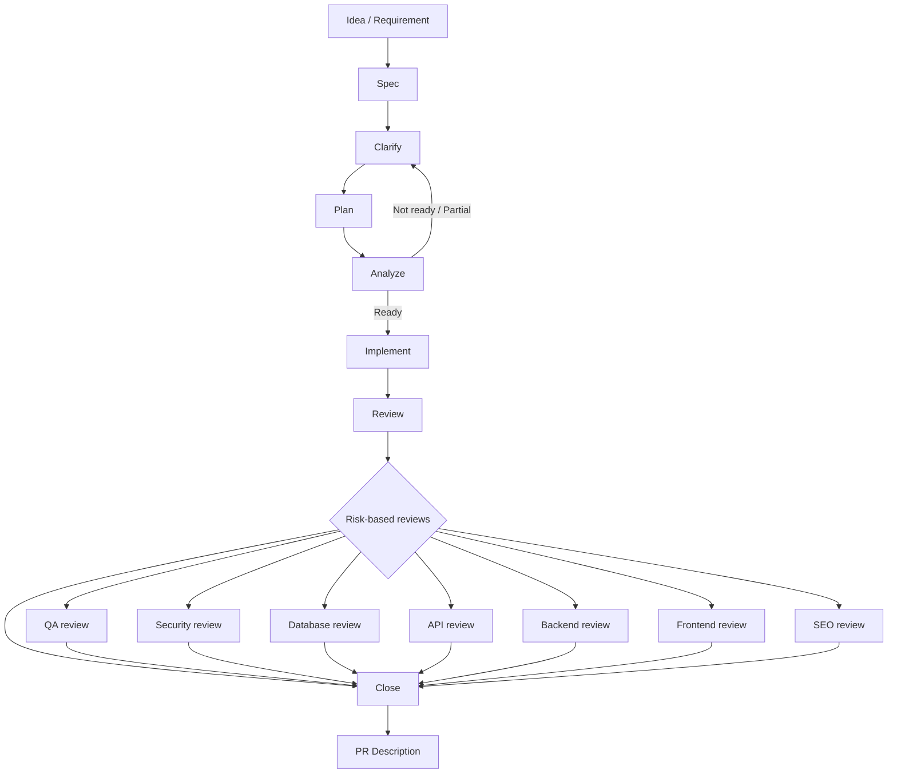
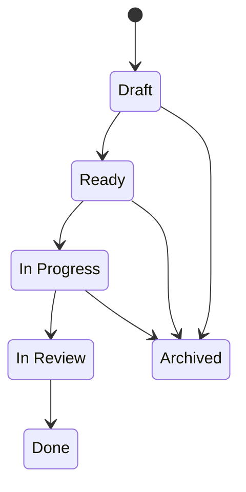
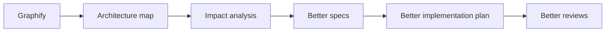

# Spec-Driven Development Workflow

**A disciplined, enforceable workflow for building software with an AI copilot — without giving up engineering control.**


-lightgrey)


> **AI accelerates execution. Engineering judgment keeps control.**

---

## What this is

This repository documents a Spec-Driven Development (SDD) workflow designed to be run with [Claude Code](https://claude.com/claude-code): a reproducible sequence of specification, clarification, planning, impact analysis, scoped implementation, and layered review that sits between "having an idea" and "opening a pull request."

It is not a demo. It is the process used to build real features in real codebases, where an unreviewed change to auth, payments, or a database schema is expensive to get wrong. The workflow assumes the AI will write a meaningful share of the code — that part isn't in question. What it adds is the structure around that code: a written spec before implementation starts, an explicit plan before files change, a consistency check before tasks are marked done, and a set of review passes scoped to what the change actually touches (not a fixed checklist run blindly on every change).

The AI — Claude Code — acts as an execution copilot inside this process. It writes specs, plans, code, and review reports following the rules below. It does not decide what gets built, what risk is acceptable, or which changes should not be made — those decisions, and the responsibility for them, stay with the engineer.

Some of the enforcement described here is not just convention — it's wired into Claude Code hooks that can technically block an action (see [Enforcement, not just documentation](#enforcement-not-just-documentation)). Other parts, like the Graphify integration, are part of the intended design and are explicitly marked as **planned**, not shipped.

---

## Visual workflow



Specialized reviews are not run on every change. They're triggered by what the spec actually declares — a feature with no schema changes doesn't get a database review; a feature with no public endpoint doesn't get an API review. The trigger conditions are fixed and checked automatically during `spec-analyze` (see [Command lifecycle](#command-lifecycle)).

### Spec status lifecycle

Every feature spec carries an explicit status, and nothing skips ahead in this sequence:



- **Draft** — spec exists, not yet plannable.
- **Ready** — plan and tasks exist, implementation can start.
- **In Progress** — at least one task has been implemented.
- **In Review** — all tasks complete, `spec-review` passed, specialized reviews pending.
- **Done** — all required reviews complete, feature closed.
- **Archived** — abandoned or superseded.

Implementation cannot start against a `Draft` spec, and a feature cannot close from anything other than `In Review`. These checks are enforced by the corresponding skills themselves (`spec-implement` and `spec-close` both refuse to proceed if the status doesn't match), not left as a convention to remember.

---

## Core philosophy

| Principle | Meaning |
|---|---|
| Spec first | No non-trivial implementation starts without a written spec describing the problem, the goal, and what's explicitly out of scope. |
| Clarify before plan | Ambiguity is resolved in writing before a plan is built on top of it — assumptions are documented, not silently made. |
| Impact-aware | Before code changes, the plan names the impacted modules, dependencies, risks, and rollback strategy. |
| Scoped implementation | Only the task at hand is implemented — no speculative abstractions, no unrelated file changes, no behavior outside the spec. |
| Review-driven | Reviews are triggered by what the change actually touches (auth, schema, API, UI), not run as a blanket checklist. |
| Traceable | Every task maps back to an acceptance criterion; every non-obvious decision is written down with its reasoning. |
| Human-owned | The AI executes the process. The engineer decides what to build, what to accept, and what to reject. |

Not every change goes through the full ceremony. Trivial, low-risk changes — typo fixes, small styling tweaks, isolated one-line bug fixes — are handled directly, without specs, plans, or review chains. The workflow is reserved for changes where the cost of being wrong justifies the cost of the process: new features, API changes, database changes, security-sensitive logic, and multi-file refactors.

---

## Command lifecycle

Each step below is implemented as a Claude Code skill and invoked as a slash command. **40 skills are published in [`skills/`](skills/)** — every command in this section and the next exists as a real `SKILL.md` file in this repository, not as a description of a future feature. This is the core lifecycle:

| Command | Purpose | Output |
|---|---|---|
| `/project-init` | Initialize or update the project's engineering constitution (stack, conventions, mandatory reviews) | `specs/CONSTITUTION.md`, `specs/features/` |
| `/spec-create` | Create the feature specification, with an automatic clarification pass | `SPEC.md` (status: `Draft`) |
| `/spec-clarify` | Run a deeper clarification pass when blocking questions remain | Updated `SPEC.md` |
| `/spec-plan` | Convert an approved spec into an implementation plan | `PLAN.md`, `TASKS.md`, `DECISIONS.md`; `SPEC.md` promoted to `Ready` |
| `/spec-analyze` | Validate consistency across spec, plan, tasks, and decisions; detect which specialized reviews are needed | Readiness verdict (`Ready` / `Partial` / `Not ready`) + findings |
| `/spec-implement` | Implement the next scoped task, test-driven, one task at a time | Code changes, updated tests, updated `TASKS.md` |
| `/spec-review` | Review the implementation against spec, plan, and tasks | Review verdict |
| `/qa-review` | Validate functional behavior, edge cases, and regressions | QA verdict |
| `/security-review` | Review authentication, authorization, data exposure, secrets, injection risks | Security verdict |
| `/database-review` | Review schema changes, migrations, indexes, transactions, data integrity | Database verdict |
| `/api-review` | Review contracts, DTOs, versioning, backward compatibility | API verdict |
| `/backend-review` | Review services, business logic, and data access patterns | Backend verdict |
| `/frontend-review` | Review components, state management, and rendering behavior | Frontend verdict |
| `/seo-review` | Review metadata, Core Web Vitals, and structured data on public pages | SEO verdict |
| `/spec-close` | Close the feature: resolve open questions, confirm acceptance criteria coverage | `SPEC.md` promoted to `Done`, implementation summary |
| `/pr-description` | Generate the final pull request description from the diff and the spec | PR description |

### Extended command set

Beyond the core lifecycle, the following commands exist and cover situations the linear flow above doesn't fully capture:

| Command | Purpose |
|---|---|
| `/sdd` | Auto-detects feature complexity and drives the whole pre-implementation chain (spec → plan → analyze) in one pass |
| `/sdd-medium`, `/sdd-full` | Force a specific workflow depth explicitly instead of relying on auto-detection |
| `/sdd-guardrails` | Consistency gate: decision state machine, source-of-truth matrix, active-plan rule, naming hygiene, money/units safety, deployment coupling |
| `/spec-status` | Overview of all specs, or a deep-dive into one feature's current state |
| `/spec-update` | Update a spec mid-implementation and propagate the change to plan, tasks, and decisions |
| `/spec-resume` | Resume an in-progress feature without re-reading the whole spec from scratch |
| `/review-all` | Run every applicable specialized review in one pass, producing a single consolidated report |
| `/performance-review` | N+1 queries, unnecessary re-renders, missing indexes, caching, algorithmic complexity |
| `/privacy-compliance-review` | GDPR/data-protection risks: personal data, consent, retention, PII in logs |
| `/refactor-review` | Optional cleanup pass before close-out — simplifies without changing behavior |
| `/architect-review` | Structural analysis and trade-off evaluation before or during implementation |
| `/test-engineer` | Test strategy design and coverage gap analysis |
| `/debugger` | Root-cause analysis for failing tests or builds |
| `/decision-mapping`, `/prototype` | Used *before* `/spec-create` when the technical approach itself is uncertain |
| `/pr-description`, `/handoff` | Final PR text generation, and conversation hand-off to a fresh session |
| `/context-manager` | Produces a bounded reading list (minimal files to load) before implementing — reduces token waste on large codebases |
| `/graphify-context` | Interprets `GRAPH_REPORT.md` for impact analysis; degrades gracefully when Graphify is absent |
| `/sdd-onboard` | Onboards an existing project into SDD: detects stack, scaffolds context docs (`PROJECT_CONTEXT`, `TECH_STACK`, `ARCHITECTURE`), never modifies application code |
| `/java-spring-reviewer` | Spring Boot service review: `@Transactional` boundaries, bean lifecycle, DTO/entity separation, exception handling, null-safety |
| `/spring-boot-api-reviewer` | Spring REST API review: controller annotations, DTO validation, error semantics (RFC 7807), OpenAPI drift, pagination |
| `/spring-security-reviewer` | Spring Security review: SecurityFilterChain, OAuth2/OIDC/Keycloak, method security, Vault/secrets, CORS, actuator exposure |
| `/java-performance-reviewer` | JVM/Spring performance review: JPA N+1, HikariCP sizing, thread pools, `@Cacheable` misuse, allocation/GC pressure |

All commands listed above exist and are in active use. None are aspirational — all 40 `SKILL.md` files are published in [`skills/`](skills/) (39 individual skill folders plus the guardrails template at [`skills/sdd-guardrails/templates/source-of-truth-matrix.md`](skills/sdd-guardrails/templates/source-of-truth-matrix.md)).

---

## Enforcement, not just documentation

A workflow that only lives in a markdown file doesn't stop anyone — human or AI — from skipping it under time pressure. Part of this setup is wired into actual Claude Code hooks that intervene at tool-call level. **11 hook families / 22 scripts are published in [`hooks/`](hooks/)** — full detail, including exactly when each one runs and how to enable it, is in [`hooks/README.md`](hooks/README.md).

| Hook | Trigger | Read-only or can modify files? | Wired by default or opt-in? | Effect |
|---|---|---|---|---|
| `git-guardrails` | Before any shell git command | Read-only | Wired by default | Blocks destructive operations outright — `push --force`, `reset --hard`, `clean -f`/`-fd`, `branch -D`, `checkout .`, `restore .` |
| `sdd-spec-guard` | Before file writes/edits | Read-only (blocks the call, doesn't edit anything) | **Opt-in** — ships as a script but is not wired in `settings.template.json` by default; must be added manually | Blocks edits to application code when no spec is `Ready` or `In Progress` |
| `project-init-check` | On session start | Read-only | Wired by default | Warns if `specs/CONSTITUTION.md` is missing or has unresolved `TODO:` sections before any spec work begins |
| `sdd-status-banner` | On session stop | Read-only | Wired by default | Reports the status of every active spec so nothing gets lost between sessions |
| `ts-check` | After every file write/edit (`.ts`/`.tsx`) | Read-only (reports errors, doesn't rewrite the file) | Wired by default | Surfaces TypeScript errors introduced by the edit |
| `eslint-fix` | After every file write/edit (`.ts`/`.tsx`/`.js`/`.jsx`) | **Can modify the file** — runs `eslint --fix` in place | Wired by default | Auto-fixes lint violations if the project has ESLint configured |
| `prettier-format` | After every file write/edit (`.ts`/`.tsx`/`.css`/`.json`/`.js`/`.jsx`) | **Can modify the file** — runs `prettier --write` in place | Wired by default | Keeps formatting consistent if the project has Prettier configured |
| `maven-compile` | After every file write/edit (`.java`) | Read-only (runs `mvnw compile`, doesn't rewrite source) | Wired by default | Surfaces Java compile errors if the project has a Maven wrapper |
| `graphify-stale-reminder` | On session start | Read-only | **Opt-in** | Warns if `GRAPH_REPORT.md` is missing or stale (>7 days older than newest source). Never blocks — reminder only |
| `java-build-test-guard` | After every file write/edit (`.java`) | Read-only (runs Maven compile, reports errors) | Wired by default (java-spring profile) | Compile errors in Java files going unnoticed until next manual build — Maven-first, Gradle fallback |
| `spring-config-guard` | After every file write/edit (`application*.yml`/`.properties`) | Read-only | Wired by default (java-spring profile) | Plaintext secrets, full actuator exposure, or `debug=true` in non-local Spring profiles |

Every hook is scoped defensively — the format/lint/type/build hooks only act if the project actually has the relevant tool configured (`tsconfig.json`, `.eslintrc*`, `.prettierrc*`, `mvnw`); otherwise they're a no-op.

This is the difference between "I asked the AI to follow the spec" and "the tooling refuses to let the AI skip it."

---

## Consistency guardrails

Specs change. A feature can go through several rounds of "let's actually do it differently" before landing on a final approach, and nothing forces every document to catch up automatically. A dedicated guardrails pass runs before planning, implementing, or closing a feature, and checks for:

- **Decision state machine** — at most one `Accepted` decision per architectural axis; a superseded decision is never left looking current.
- **Source-of-truth matrix** — for each concept (data model, business rules, money/units, deployment order...), exactly one document is authoritative, and the others must agree with it.
- **Active plan rule** — an obsolete, partial, or `NEEDS REVIEW` plan is never implemented from.
- **Naming hygiene** — a name that already caused confusion (an ambiguous unit, an unclear contract) is never silently reused with a new meaning.
- **Money/units safety** — any field touching pricing, discounts, or a payment provider requires an explicit units table and boundary validation before implementation starts.
- **Deployment coupling** — a schema migration paired with dependent code requires an explicit rollout/rollback answer before the feature closes.

This is what stops a spec from silently drifting out of sync with the plan, the tasks, and the actual code across multiple revisions — a common failure mode in AI-assisted development that isn't specific to any one stack.

---

## Templates

Starter templates are published in [`specs/_templates/`](specs/_templates/), ready to copy into `specs/features/<NNN-feature-name>/` or `specs/`:

| Template | Status |
|---|---|
| `SPEC.md` | Extracted verbatim from `skills/spec-create/SKILL.md` |
| `PLAN.md` | Extracted verbatim from `skills/spec-plan/SKILL.md` |
| `TASKS.md` | Extracted verbatim from `skills/spec-plan/SKILL.md` |
| `DECISIONS.md` | Extracted verbatim from `skills/spec-plan/SKILL.md` |
| `CONSTITUTION.md` | **Draft template — not a literal extraction.** `skills/project-init/SKILL.md` builds this file through an interview rather than a fixed template, so this version is a reasonable skeleton inferred from that interview's structure (project basics, architecture, quality gates), not a copy of an existing template. Running `/project-init` is still the source of truth. |

---

## Graphify integration

> **Status: shipped (Phase 1).** Three skills (`/context-manager`, `/graphify-context`, `/sdd-onboard`) and one hook (`graphify-stale-reminder`) provide Graphify-aware context loading. All degrade gracefully when Graphify is absent — it remains an optional accelerator, never a dependency.

The intended purpose of Graphify in this workflow is architectural discovery: mapping a codebase's structure and dependencies *before* planning or reviewing a change, so specs and plans are grounded in what the system actually looks like rather than in assumption.



Once integrated, the intended use is to run discovery before `spec-plan`, `spec-analyze`, and the specialized review commands — not as a replacement for any of them.

> **Graphify is a discovery layer, not a source of truth.**
> It will not replace reading the actual files, running the actual tests, or the engineer's judgment about what the dependency graph implies. It surfaces structure; it doesn't decide correctness.

---

## Example workflow

```bash
/project-init
/spec-create "Add rate limiting to the public checkout API"
/spec-clarify
/spec-plan
/spec-analyze
/spec-implement all
/spec-review
/qa-review
/security-review
/api-review
/spec-close
/pr-description
```

`spec-analyze` determines which of `security-review`, `api-review`, `database-review`, `backend-review`, `frontend-review`, and `seo-review` actually apply based on what the spec touches — the example above shows the set for a public API change; a UI-only feature would trigger a different subset.

---

## What this is not

- **Not "write a prompt and hope."** Every non-trivial change starts from a written spec, not a conversational request executed on faith.
- **Not fully automated development.** The engineer decides what gets built, which risks are acceptable, and which changes should not happen at all — the AI does not make that call.
- **Not a replacement for tests or human review.** Reviews here are structured checklists executed by an agent; a human still owns the merge decision.
- **Not one-size-fits-all ceremony.** Trivial changes explicitly skip the full workflow — see [Core philosophy](#core-philosophy).

---

## Repository structure

```
spec-driven-development/
├── README.md
├── LICENSE                             # MIT
├── CLAUDE.md.example                   # sanitized, generic project instructions — copy into your own project as CLAUDE.md
├── settings.template.json              # Claude Code hook wiring, using ${CLAUDE_PROJECT_DIR}
├── profiles.json                       # profile manifest — maps profiles to skills/hooks/templates
├── .gitignore
├── docs/
│   ├── INSTALL.md                      # step-by-step installation guide (Windows, macOS/Linux)
│   ├── ROADMAP_JAVA_SPRING_CONTEXT.md  # roadmap for Java/Spring profile + Graphify context layer
│   └── _templates/                     # context doc templates (copied into projects by /sdd-onboard)
│       ├── PROJECT_CONTEXT.md
│       ├── TECH_STACK.md
│       ├── ARCHITECTURE.md
│       ├── TESTING.md
│       ├── SECURITY.md
│       └── DEPLOYMENT.md
├── skills/                             # 40 skill definitions — every command in this README
│   ├── sdd/SKILL.md
│   ├── sdd-medium/SKILL.md
│   ├── sdd-full/SKILL.md
│   ├── sdd-guardrails/
│   │   ├── SKILL.md
│   │   └── templates/source-of-truth-matrix.md
│   ├── project-init/SKILL.md
│   ├── spec-create/SKILL.md
│   ├── spec-clarify/SKILL.md
│   ├── spec-plan/SKILL.md
│   ├── spec-analyze/SKILL.md
│   ├── spec-implement/SKILL.md
│   ├── spec-review/SKILL.md
│   ├── spec-close/SKILL.md
│   ├── spec-status/SKILL.md
│   ├── spec-update/SKILL.md
│   ├── spec-resume/SKILL.md
│   ├── qa-review/SKILL.md
│   ├── security-review/SKILL.md
│   ├── database-review/SKILL.md
│   ├── api-review/SKILL.md
│   ├── backend-review/SKILL.md
│   ├── frontend-review/SKILL.md
│   ├── seo-review/SKILL.md
│   ├── performance-review/SKILL.md
│   ├── privacy-compliance-review/SKILL.md
│   ├── refactor-review/SKILL.md
│   ├── review-all/SKILL.md
│   ├── architect-review/SKILL.md
│   ├── test-engineer/SKILL.md
│   ├── debugger/SKILL.md
│   ├── prototype/SKILL.md
│   ├── decision-mapping/SKILL.md
│   ├── pr-description/SKILL.md
│   ├── handoff/SKILL.md
│   ├── context-manager/SKILL.md
│   ├── graphify-context/SKILL.md
│   ├── sdd-onboard/SKILL.md
│   ├── java-spring-reviewer/SKILL.md
│   ├── spring-boot-api-reviewer/SKILL.md
│   ├── spring-security-reviewer/SKILL.md
│   └── java-performance-reviewer/SKILL.md
├── hooks/                              # 11 hook families, 22 scripts (.ps1 + .sh)
│   ├── README.md
│   ├── git-guardrails.ps1 / .sh
│   ├── sdd-spec-guard.ps1 / .sh
│   ├── sdd-status-banner.ps1 / .sh
│   ├── project-init-check.ps1 / .sh
│   ├── ts-check.ps1 / .sh
│   ├── eslint-fix.ps1 / .sh
│   ├── prettier-format.ps1 / .sh
│   ├── maven-compile.ps1 / .sh
│   ├── graphify-stale-reminder.ps1 / .sh
│   ├── java-build-test-guard.ps1 / .sh
│   └── spring-config-guard.ps1 / .sh
├── specs/
│   ├── _templates/
│   │   ├── CONSTITUTION.md            # draft template — see Templates section above
│   │   ├── SPEC.md
│   │   ├── PLAN.md
│   │   ├── TASKS.md
│   │   ├── DECISIONS.md
│   │   ├── PR_DESCRIPTION.md
│   │   └── REVIEW_REPORT_TEMPLATE.md
│   └── features/                       # feature specs (when dogfooding the repo itself)
└── examples/
    └── README.md                       # placeholder — no worked example yet
```

---

## Status of this repository

This repository currently ships:

- [x] `README.md` — methodology, philosophy, command reference, and enforcement model.
- [x] `skills/` — 40 published skill definitions.
- [x] `hooks/` — 11 hook families, 22 scripts.
- [x] `hooks/README.md` — per-hook trigger, effect, and activation guide.
- [x] `specs/_templates/` — `SPEC.md`, `PLAN.md`, `TASKS.md`, `DECISIONS.md` (verbatim), `CONSTITUTION.md` (draft), `PR_DESCRIPTION.md`, `REVIEW_REPORT_TEMPLATE.md`.
- [x] `docs/_templates/` — `PROJECT_CONTEXT.md`, `TECH_STACK.md`, `ARCHITECTURE.md`, `TESTING.md`, `SECURITY.md`, `DEPLOYMENT.md` (context doc templates for project onboarding and Java/Spring profile).
- [x] `examples/README.md` — placeholder for a future worked example.
- [x] `CLAUDE.md.example` — sanitized, generic project instructions.
- [x] `settings.template.json` — sanitized hook wiring.
- [x] `profiles.json` — profile manifest (core, java-spring-backend, messaging, payments, next-prisma, blockchain-crypto).
- [x] `docs/INSTALL.md` — step-by-step installation guide (Windows, macOS/Linux).
- [x] `LICENSE` — MIT.
- [x] `.gitignore` — excludes local Claude Code settings, generated artifacts, and secrets.
- [x] Graphify-aware context layer — `context-manager`, `graphify-context`, `sdd-onboard` skills + `graphify-stale-reminder` hook.

Not yet in this repository:

- [ ] Graphify external tool integration — see [Graphify integration (Planned)](#graphify-integration-planned).
- [ ] Real-world example specs in `examples/`.
- [ ] `CONTRIBUTING.md`.

> **Note:** Graphify-aware skills are shipped and functional, but Graphify itself is still an optional external tool. The workflow degrades gracefully when `GRAPH_REPORT.md` is missing — no skill or hook fails because of it.

---

## Roadmap

**Completed:**

- [x] README with methodology, philosophy, command reference, and enforcement model
- [x] 40 skills published (33 original + 3 context-layer + 4 java-spring)
- [x] Hooks published (11 families / 22 scripts) with activation guide
- [x] Templates published — SDD lifecycle (`specs/_templates/`) + project context (`docs/_templates/`)
- [x] Sanitized `CLAUDE.md.example`
- [x] Sanitized `settings.template.json`
- [x] `profiles.json` — profile manifest
- [x] `docs/INSTALL.md` — installation guide
- [x] `LICENSE` — MIT
- [x] `examples/` placeholder
- [x] Graphify-aware context layer (skills + hook — degrades gracefully without Graphify)
- [x] Java/Spring backend profile — 4 review skills, 2 defensive hooks, 3 context templates
- [x] Installer `-Profile` flag consuming `profiles.json` (both `.ps1` and `.sh`)

**Planned:**

- [ ] Graphify external tool integration (the *skills* are shipped; the *tool itself* is still external and optional)
- [ ] Real example specs (a feature carried end-to-end through the workflow)
- [ ] `CONTRIBUTING.md`
- [ ] Messaging/event-driven skills (Phase 3)
- [ ] Defensive hooks (Phase 4 — secret-scan, sensitive-file-guard, destructive-cmd-guard)
- [ ] Example walkthroughs (Phase 5)

---

## Profiles

This workflow supports **stack profiles** declared in [`profiles.json`](profiles.json). Profiles control which skills, hooks, and templates are active for a given project:

| Profile | Status | Build tool |
|---|---|---|
| `core` | Always installed | — |
| `java-spring-backend` | **Default** | Maven (primary); Gradle detection as fallback |
| `messaging-event-driven` | Optional overlay | — |
| `payments-fintech` | Optional overlay | — |
| `next-prisma-web` | Optional | — |
| `blockchain-crypto` | Optional — **disabled by default** | — |

The installer installs `core` + the default profile (`java-spring-backend`) when no `-Profile`/`--profile` flag is passed.

### Shipped vs. planned

Every profile in `profiles.json` declares two kinds of entries:

- **`skills` / `hooks` / `templates`** — SHIPPED. These must exist on disk. If one of them is missing, the installer treats it as a manifest/repo integrity failure (profiles.json drifted from the repo) and fails loudly with `[ERROR]` — it never installs silently around the gap.
- **`plannedSkills` / `plannedHooks` / `plannedTemplates`** — roadmap-only. These may legitimately not exist yet (e.g. Phase 3 candidates). The installer reports each one as `[planned] ... not installed (planned for a future phase)` and never treats their absence as an error.

The installer never falls back to "install everything" or "no filtering." An unknown profile name, an explicit request for the disabled `blockchain-crypto` profile, or a missing shipped item all abort the run with a clear `[ERROR]` before (or, for the last case, in addition to) any files are touched.

```bash
# Install default (core + java-spring-backend)
./install.sh

# Install specific profiles
./install.sh --profile java-spring-backend --profile messaging-event-driven

# PowerShell equivalent
.\install.ps1 -Profile java-spring-backend,messaging-event-driven
```

`install.sh` resolves `profiles.json` using **`python3`** (standard library `json` only — `jq` is not required for this). If `python3` isn't available, the script fails with a clear message instead of guessing; see [`docs/INSTALL.md`](docs/INSTALL.md) for details. `install.ps1` uses PowerShell's built-in `ConvertFrom-Json`.

---

## License

MIT — see [`LICENSE`](LICENSE).
