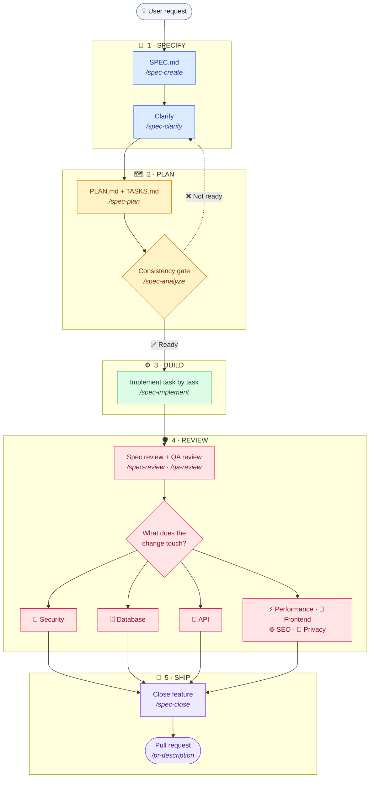
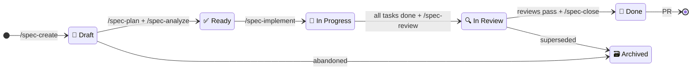
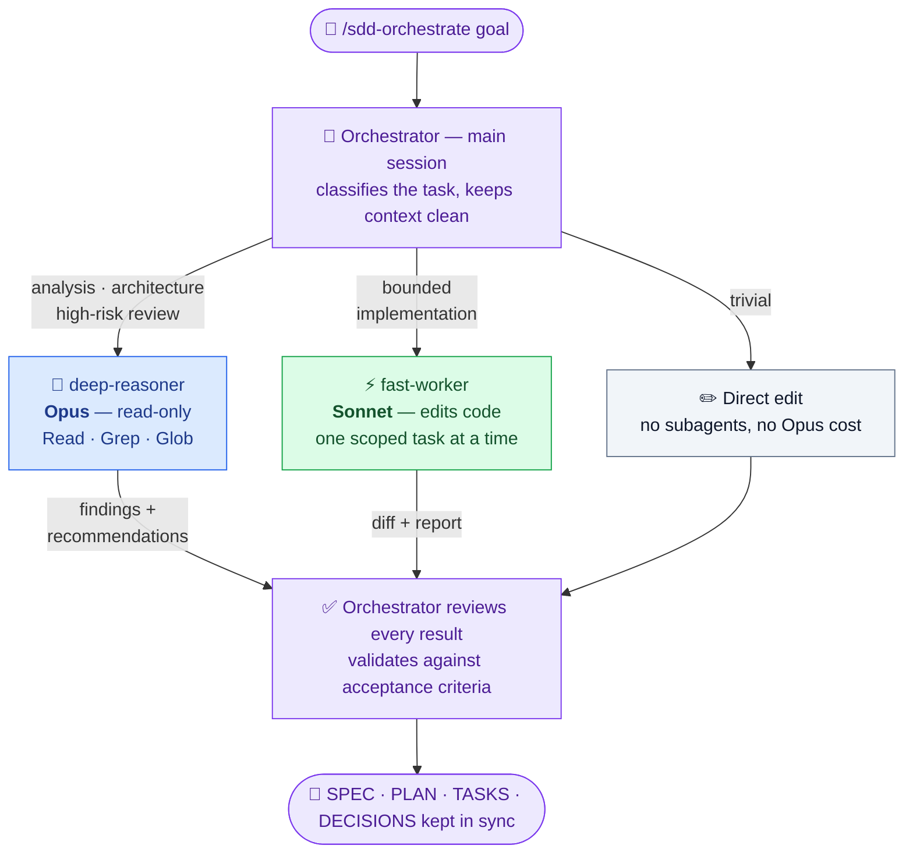
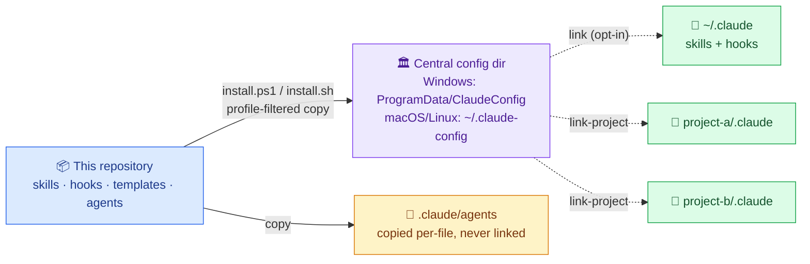
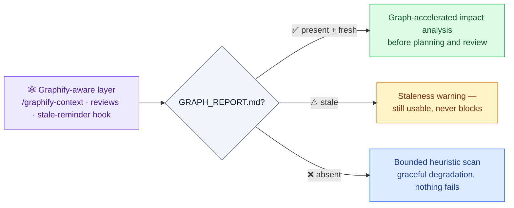

<div align="center">

# 🧭 Spec-Driven Development for Claude Code

### Spec → Plan → Build → Review → Ship

**A disciplined, enforceable workflow for AI-assisted software engineering —<br/>specs, plans, reviews, guardrails, and multi-model orchestration, without giving up engineering control.**


*AI accelerates execution. Engineering judgment keeps control.*

[🚀 Quickstart](#-quickstart) · [🔄 Core workflow](#-core-workflow) · [🧠 Orchestration](#-multi-model-orchestration) · [⚙️ Installation](#️-installation) · [🛡️ Safety model](#️-safety-model)

</div>

---

This repository turns [Claude Code](https://claude.com/claude-code) into a process-driven engineering environment: **<!-- count:skills-total -->61<!-- /count --> skills** (slash commands), **<!-- count:hook-families-total -->12<!-- /count --> hook families** (tool-call-level guardrails), **<!-- count:templates-total -->22<!-- /count --> document templates**, **<!-- count:agents-total -->2<!-- /count --> orchestration agents**, and a **profile-aware installer** — all versioned, reviewable, and installed from a single source of truth.

---

## Table of contents

- [🧩 What is this?](#-what-is-this)
- [🎯 Why it exists](#-why-it-exists)
- [🚀 Quickstart](#-quickstart)
- [🔄 Core workflow](#-core-workflow)
- [🧠 Multi-model orchestration](#-multi-model-orchestration)
- [🏗️ Repository architecture](#️-repository-architecture)
- [🗂️ Profiles](#️-profiles)
- [⚙️ Installation](#️-installation)
- [💻 Usage examples](#-usage-examples)
- [📚 Worked examples](#-worked-examples)
- [🛡️ Safety model](#️-safety-model)
- [📊 What is shipped now](#-what-is-shipped-now)
- [🗺️ Roadmap](#️-roadmap)
- [📐 Design principles](#-design-principles)
- [✍️ Author's note](#️-authors-note)
- [⚠️ Limitations](#️-limitations)
- [📄 License](#-license)

---

## 🧩 What is this?

A **Spec-Driven Development (SDD) workflow for AI-assisted software engineering**, packaged as installable Claude Code configuration. It is the reproducible sequence that sits between "having an idea" and "opening a pull request":

**specification → clarification → planning → consistency analysis → scoped implementation → layered review → close-out.**

Five kinds of artifacts implement it:

| Artifact | What it is | Where |
|---|---|---|
| **Skills** | Slash commands that drive each workflow step (`/spec-create`, `/spec-plan`, `/security-review`, …) as structured, repeatable procedures | [`skills/`](skills/) |
| **Hooks** | Small scripts Claude Code runs at tool-call level — they can block a destructive git command or surface a compile error *before* the session moves on | [`hooks/`](hooks/) |
| **Profiles** | A manifest ([`profiles.json`](profiles.json)) mapping stacks (Java/Spring, Next.js, messaging, …) to the skills/hooks/templates/agents they need, consumed by the installers | repo root |
| **Templates** | Starter documents for specs, plans, tasks, decisions, and project context docs | [`specs/_templates/`](specs/_templates/), [`docs/_templates/`](docs/_templates/) |
| **Agents** | Subagent definitions for the multi-model orchestrated mode — a read-only Opus analyst and a bounded Sonnet implementer | [`agents/`](agents/) |

It is not a demo. It is the process used to build real features in real codebases, where an unreviewed change to auth, payments, or a database schema is expensive to get wrong. The AI writes a meaningful share of the code — that part isn't in question. What this repo adds is the structure around that code, and the tooling that makes the structure hard to skip.

## 🎯 Why it exists

AI coding without process has a failure mode every team has now seen: requirements live in chat scrollback, the model makes silent architectural decisions, plans drift from what was actually built, and review happens (if at all) as a vibe check on a diff nobody scoped. The result is ambiguity, regressions, and hidden debt — produced faster than ever.

This workflow addresses that directly:

- **A written spec before implementation starts** — with explicit out-of-scope boundaries and acceptance criteria.
- **An explicit plan before files change** — impacted modules, risks, rollback strategy.
- **A consistency gate before tasks are marked done** — spec, plan, tasks, and decisions must agree.
- **Reviews scoped to what the change actually touches** — a schema change gets a database review; a UI-only change doesn't.
- **Decisions written down** — every non-obvious choice lands in `DECISIONS.md` with its reasoning, instead of living only in a conversation that will be compacted away.
- **Enforcement in tooling, not just prose** — hooks intervene at tool-call level (see [Safety model](#️-safety-model)).

The engineer decides what gets built, what risk is acceptable, and which changes should not happen. The AI executes the process — it does not own it.

## 🚀 Quickstart

```bash
git clone https://github.com/manujc00005/spec-driven-development.git
cd spec-driven-development

# Preview — writes nothing
./install.sh --dry-run          # macOS/Linux (requires python3)
.\install.ps1 -DryRun           # Windows

# Install core + default profile (java-spring-backend) into the central config dir
./install.sh
.\install.ps1

# Opt-in: link your ~/.claude to the central dir (skills, hooks) + copy agents
./install.sh --link-user-claude
.\install.ps1 -LinkUserClaude

# Per project: wire the shipped hooks into .claude/settings.json (additive, backs up first)
./scripts/wire-hooks.sh --project-dir <your-project>
.\scripts\wire-hooks.ps1 -ProjectDir <your-project>

# Later, to update an existing install (git pull + re-install + "what's new" report)
./scripts/update.sh             # macOS/Linux
.\scripts\update.ps1            # Windows
```

Then, in any project, start a new Claude Code session and run:

```
/project-init        # once per project — creates specs/CONSTITUTION.md
/sdd "Add rate limiting to the public checkout API"
```

Full walkthrough, per-project linking, and verification steps: [`docs/INSTALL.md`](docs/INSTALL.md).

---

## 🔄 Core workflow



Each step is a real skill invoked as a slash command. The core lifecycle:

| Command | Purpose | Output |
|---|---|---|
| `/project-init` | Create the project's engineering constitution (stack, conventions, mandatory reviews) | `specs/CONSTITUTION.md` |
| `/sdd` | Main entry point — auto-detects complexity, drives spec → plan → analyze | Whole pre-implementation chain |
| `/spec-create` | Create the feature specification, with an automatic clarification pass | `SPEC.md` (status `Draft`) |
| `/spec-clarify` | Deeper clarification pass when blocking questions remain | Updated `SPEC.md` |
| `/spec-plan` | Convert an approved spec into a plan, task list, and decision log | `PLAN.md`, `TASKS.md`, `DECISIONS.md` |
| `/spec-analyze` | Validate consistency across all four documents; detect which specialized reviews apply | Readiness verdict + findings |
| `/spec-implement` | Implement the next scoped task, test-driven, one task at a time | Code + tests, updated `TASKS.md` |
| `/spec-review` | Review the implementation against spec, plan, and tasks | Review verdict |
| `/qa-review` | Functional behavior, edge cases, regressions | QA verdict |
| `/spec-close` | Resolve open questions, confirm acceptance-criteria coverage, close the feature | Implementation summary |
| `/pr-description` | Generate the pull request description from the diff and the spec | PR text |

Specialized reviews are triggered by what the spec declares, not run blindly: `/security-review`, `/database-review`, `/api-review`, `/backend-review`, `/frontend-review`, `/performance-review`, `/seo-review`, `/privacy-compliance-review`. Supporting commands cover the rest of the lifecycle: `/sdd-guardrails` (consistency gate), `/spec-status`, `/spec-update`, `/spec-resume`, `/review-all`, `/architect-review`, `/test-engineer`, `/debugger`, `/prototype`, `/decision-mapping`, `/refactor-review`, `/handoff`, `/context-manager`, `/graphify-context`, `/sdd-onboard`, plus the stack-specific reviewers listed under [Profiles](#️-profiles). Every command in this README exists as a `SKILL.md` file in [`skills/`](skills/) — every one of them; none are aspirational.

#### Mindset skills

The process skills above tell a model *what steps to run*; these nine tell it *how to think* while running them — actionable rules, named anti-patterns, and a self-check, not personality prose. Invoke them explicitly (`/verifier`, …) or read them as manuals:

- `/verifier` — "done" means observed working end-to-end, not "it compiles".
- `/scope-keeper` — do exactly what was asked: minimal diff, no drive-by refactors, code that reads like its neighbors.
- `/communicator` — lead with the outcome, full sentences over fragments and arrow-chains, selectivity over compression.
- `/stopper` — proceed on reversible actions, stop for destructive ones, never end a turn promising work instead of doing it.
- `/honest-advisor` — correct a flawed premise instead of complying; one recommendation, not a menu; bad news at full strength.
- `/threat-modeler` — attacker mindset while writing code ("who can call this, worst-case input?"); complements `/security-review`.
- `/scout` — orient before editing: read structure, search before building, derive conventions from the code; complements `/sdd-onboard`.
- `/decomposer` — decompose before coding, find the one irreversible decision, skip planning when trivial; complements `/spec-plan`.
- `/root-causer` — reproduce before hypothesizing, fix the cause not the symptom; complements `/debugger`.

### Spec status lifecycle



Implementation cannot start against a `Draft` spec, and a feature cannot close from anything other than `In Review`. These checks live in the skills themselves (`spec-implement` and `spec-close` refuse to proceed on a wrong status), not in convention.

Not every change goes through the full ceremony: typo fixes, small styling tweaks, and isolated one-line bug fixes are handled directly. The workflow is reserved for changes where the cost of being wrong justifies the cost of the process.

---

## 🧠 Multi-model orchestration

The workflow can run in an orchestrated multi-model mode via **`/sdd-orchestrate <goal>`**, which splits work across models by what each is actually good (and priced) for:



| Role | Model | Responsibility |
|---|---|---|
| **Orchestrator** | Main session (Fable when available, otherwise your session model) | Classify the task, keep context clean, write briefs, review every result, validate against acceptance criteria |
| **`deep-reasoner`** | Opus (read-only: `Read`, `Grep`, `Glob`) | Architecture, root cause, security, concurrency, migrations, high-risk review — analyzes and recommends, structurally cannot edit |
| **`fast-worker`** | Sonnet (can edit) | Implements one bounded task at a time; stops and reports if it hits an undocumented architectural decision instead of guessing |

Key properties:

- **Cost-aware routing** — trivial changes never touch Opus; four task-classification levels decide the flow.
- **Analysis-only mode** — "audit"/"investigate" requests produce a prioritized report and implement nothing.
- **No overlapping parallel edits** — parallel `fast-worker` tasks are allowed only when file/contract/migration/state overlap is impossible.
- **Documented fallback policy** — model names are aliases (`opus`, `sonnet`), and there is an explicit fallback table for when Fable, Opus, or Sonnet is unavailable on your account. No configuration ever pins an invented model ID.
- **Honest verification status** — shipped, structurally verified (frontmatter, tools, idempotent install), and **live-verified**: a fresh Claude Code session after a real deploy recognized both agents with the correct models and the `/sdd-orchestrate` command (2026-07-13; procedure and evidence in [`specs/features/004-multimodel-orchestration/`](specs/features/004-multimodel-orchestration/)). The distinction between structural and live verification was tracked explicitly until the live check passed.

Full documentation — architecture, task classification, cost control, fallback, install, rollback: [`docs/SDD-ORCHESTRATION.md`](docs/SDD-ORCHESTRATION.md).

---

## 🏗️ Repository architecture

```
spec-driven-development/
├── README.md
├── LICENSE                        # MIT
├── profiles.json                  # profile manifest — the installer's source of truth
├── CLAUDE.md.example              # sanitized project instructions — copy/merge into your own CLAUDE.md
├── settings.template.json         # hook wiring template — Windows (PowerShell commands)
├── settings.template.sh.json      # hook wiring template — macOS/Linux (bash commands, same hook set)
├── install.ps1 / install.sh       # profile-aware installers (central config dir + optional ~/.claude linking)
├── link-project.ps1 / .sh         # link one project's .claude/ to the central dir
├── skills/                        # 52 skills — one folder per slash command
├── hooks/                         # 11 hook families × (.ps1 + .sh) = 22 scripts
│   ├── README.md                  # per-hook trigger, effect, and activation guide
│   └── lib/claude-json.sh         # dependency-free JSON helper for .sh hooks (no jq, no python)
├── agents/                        # deep-reasoner.md (Opus) + fast-worker.md (Sonnet) — copied, never linked
├── docs/
│   ├── INSTALL.md                 # step-by-step install guide (Windows, macOS/Linux)
│   ├── SDD-ORCHESTRATION.md       # multi-model orchestration reference
│   ├── ROADMAP_JAVA_SPRING_CONTEXT.md  # original phase-planning document (historical)
│   └── _templates/                # 10 project-context doc templates (PROJECT_CONTEXT, TECH_STACK,
│                                  #   ARCHITECTURE, TESTING, SECURITY, DEPLOYMENT, MESSAGING,
│                                  #   MICROSERVICES_PATTERNS, GRAPHIFY, PROJECT_GRAPH)
├── specs/
│   ├── _templates/                # 7 SDD lifecycle templates (SPEC, PLAN, TASKS, DECISIONS,
│   │                              #   CONSTITUTION, PR_DESCRIPTION, REVIEW_REPORT_TEMPLATE)
│   └── features/                  # this repo's own features, built with its own workflow (dogfooding)
└── examples/                      # worked end-to-end examples (payment webhook idempotency)
```

How content flows at install time:



- The **central config directory** (Windows: `C:\ProgramData\ClaudeConfig`; macOS/Linux: `~/.claude-config` by default) receives a profile-filtered copy of skills, hooks, templates, and agents.
- `~/.claude/skills` and `~/.claude/hooks` (and per-project `.claude/skills|hooks`) are **linked** (junction/symlink) to the central dir — update the central dir once, every consumer sees it.
- **Agents are the deliberate exception: copied per-file, never linked**, because `.claude/agents` directories commonly contain user-authored agents that a directory link would hide. Consequence: re-run the installer after `git pull` to refresh agents.
- `CLAUDE.md` and `settings.json` are **never written directly** — only `CLAUDE.md.example` and `settings.template.json` ship, and merging them into your real config is an explicit manual step.

---

## 🗂️ Profiles

Profiles control which skills, hooks, templates, and agents get installed, declared in [`profiles.json`](profiles.json):

| Profile | Status | What it adds |
|---|---|---|
| `core` | Always installed | Full SDD lifecycle, guardrails, generic reviews, orchestration (<!-- count:core-skills -->41<!-- /count --> skills, <!-- count:core-hooks -->6<!-- /count --> hooks, <!-- count:core-templates -->17<!-- /count --> templates, <!-- count:core-agents -->2<!-- /count --> agents) |
| `java-spring-backend` | **Default** | <!-- count:java-spring-backend-skills -->8<!-- /count --> review skills (JPA/transactions, Spring REST, Spring Security, JVM performance, observability, database, API, backend), <!-- count:java-spring-backend-hooks -->3<!-- /count --> hooks, <!-- count:java-spring-backend-templates -->6<!-- /count --> context templates. Maven primary, Gradle fallback |
| `messaging-event-driven` | Optional | `event-driven-reviewer` (Kafka/RabbitMQ/ActiveMQ, outbox, saga, DLQ) + `microservices-patterns-reviewer` (boundaries, resilience, contracts), <!-- count:messaging-event-driven-templates -->2<!-- /count --> templates |
| `next-prisma-web` | Optional | Frontend/privacy/database reviews + `prisma-migration-reviewer` (generated-SQL safety) + `nextjs-server-actions-reviewer` (action = public endpoint) + `ts-check`/`eslint-fix`/`prettier-format` hooks (`prisma-migration-guard` hook still planned) |
| `seo-geo-addon` | Optional overlay, billable | Full SEO family: `seo-review` (technical on-page + hreflang), `aeo-review` (answer extraction), `geo-review` (generative-engine citability), `ai-visibility-review` (AI-crawler access policy). Every skill gates on the service being contracted in `specs/SERVICES.md`. Install only when SEO/GEO/AEO/AI-visibility is a contracted service |
| `payments-fintech` | Optional overlay | `stripe-payments-reviewer` (webhooks, idempotency keys, minor units, key hygiene) + `payment-idempotency-reviewer` (processor-agnostic exactly-once effects). `stripe-review-reminder` hook still planned |
| `blockchain-crypto` | **Disabled** | Placeholder. The installer refuses to install it — requesting it explicitly is a hard error by design |

Rules the installers enforce:

- **`core` is always installed.** With no `--profile`/`-Profile` flag, you get `core` + the default (`java-spring-backend`). The moment you pass any explicit profile, you get `core` + exactly what you asked for — no silent default stacking.
- **Profiles combine explicitly.** `messaging-event-driven` assumes a Java/Spring service underneath but is *not* an automatic overlay — to get both: `--profile java-spring-backend,messaging-event-driven`.
- **Shipped vs. planned is a hard distinction.** `skills`/`hooks`/`templates`/`agents` entries must exist on disk — a missing one is a manifest-integrity error (exit 1), never a silent skip. `planned*` entries are roadmap-only, reported as `[planned] … not installed`, never an error.
- **No guessing.** Unknown profile name, explicitly requested disabled profile, or unparsable `profiles.json` → clear `[ERROR]`, non-zero exit, no fallback to "install everything".
- **Billable scope is explicit.** `seo-geo-addon` (and any future paid add-on) is never bundled into a base profile — it installs only via `--profile next-prisma-web,seo-geo-addon`, matching a client actually having contracted the service in `specs/SERVICES.md`. See the Billing boundary section in `specs/_templates/CONSTITUTION.md`.

---

## ⚙️ Installation

Three concerns, three scripts — full guide in [`docs/INSTALL.md`](docs/INSTALL.md):

| Concern | Script | Touches |
|---|---|---|
| Install into a central config dir | `install.ps1` / `install.sh` | Central directory only, by default |
| Link your per-user `~/.claude` | same scripts, `-LinkUserClaude` / `--link-user-claude` | `~/.claude` — **opt-in** |
| Link one project | `link-project.ps1` / `link-project.sh` | `<project>/.claude` only |

**Windows**

```powershell
.\install.ps1 -DryRun                                        # preview, writes nothing
.\install.ps1                                                # install into C:\ProgramData\ClaudeConfig
.\install.ps1 -Profile java-spring-backend,messaging-event-driven
.\install.ps1 -LinkUserClaude                                # opt-in ~/.claude linking + agent copy
.\link-project.ps1 -ProjectDir C:\code\my-app                # wire one project
```

**macOS/Linux** — requires `python3` (standard-library `json` only; `jq` is *not* used anywhere):

```bash
./install.sh --dry-run                                       # preview, writes nothing
./install.sh                                                 # install into ~/.claude-config
./install.sh --profile java-spring-backend,messaging-event-driven
./install.sh --link-user-claude                              # opt-in ~/.claude linking + agent copy
cd ~/code/my-app && /path/to/repo/link-project.sh            # wire one project
```

After installing: start a **new Claude Code session** (skills/agents are discovered at session start), and merge the relevant blocks of `CLAUDE.md.example` into your real `CLAUDE.md` — the installers never write it for you.

**Using it in an existing project:** run `/sdd-onboard` — it detects the stack, scaffolds the context docs (`PROJECT_CONTEXT.md`, `TECH_STACK.md`, `ARCHITECTURE.md`), and never modifies application code. Then `/project-init` for the constitution.

**Customizing:** everything is plain markdown and JSON. Edit skills in the central dir (all links see the change immediately), edit copied agents per project (the installer detects the difference and preserves your customization unless you `--force`), add project-specific profiles to your own fork of `profiles.json`, and wire only the hooks you want in `.claude/settings.json` starting from `settings.template.json`.

---

## 💻 Usage examples

```bash
# Full lifecycle for a security-sensitive API change
/spec-create "Add rate limiting to the public checkout API"
/spec-plan
/spec-analyze
/spec-implement all
/spec-review
/qa-review
/security-review
/api-review
/spec-close
/pr-description

# Let the workflow pick the depth itself
/sdd "Add CSV export to the admin orders list"

# Multi-model orchestration — implementation
/sdd-orchestrate Fix the duplicate-webhook handling in the payment service.
Investigate the root cause before implementing.

# Multi-model orchestration — audit only, nothing implemented
/sdd-orchestrate Audit webhook idempotency and deliver prioritized findings.
Do not modify code.

# Stack-specific reviews (java-spring-backend / messaging-event-driven profiles)
/java-spring-reviewer specs/features/012-refund-flow
/event-driven-reviewer specs/features/014-order-events
```

---

## 📚 Worked examples

This repository includes professional worked examples demonstrating the SDD framework on real engineering problems:

- **[Payment Webhook Idempotency](examples/001-payment-webhook-idempotency/)** — SDD applied to a Java/Spring webhook receiver pattern: constraint-based idempotency (UNIQUE constraint, not locks), HMAC signature verification, proper HTTP status codes for retry control (200, 202, 400, 401), and security-first design (verify before process). Includes complete SPEC, PLAN, TASKS, DECISIONS, 14 test cases, database migration, and review artifacts. Educational example showing the pattern, not a complete production system.

---

## 🛡️ Safety model

The same discipline the workflow demands from code applies to the tooling itself.

**Installer guarantees** (all three scripts, both platforms):

- **Idempotent** — re-running with nothing changed is a reported no-op.
- **Never deletes** — only creates missing files or (with `-Force`/`--force`) overwrites differing ones **after** taking a timestamped backup under `_install-backups/<timestamp>/`.
- **Skip-on-diff** — a file that differs from the source (e.g. your customization) is reported and skipped unless you explicitly force it.
- **`--dry-run` / `-DryRun`** — full preview mode on every script; the dry-run path never writes.
- **Never touches `settings.local.json`** — excluded by an explicit pattern check in every copy path.
- **Never copies `.env` or secrets** — the repo contains none, and local settings are git-ignored and install-excluded.
- **Never writes a real `CLAUDE.md` or `settings.json`** — only the `.example`/`.template` files ship.
- **`~/.claude` linking is opt-in**, and replacing a real directory with a link requires `--force` and produces a `<path>.bak-<timestamp>` backup first.
- **Agents copied per-file, additively** — never a directory link over `.claude/agents`.

**Hook guarantees** ([`hooks/README.md`](hooks/README.md) has the per-hook table):

- `git-guardrails` blocks **every `git push`** (not just `--force`) plus `reset --hard`, `clean -f`/`-fd`, `branch -D`, `checkout .`, `restore .` — committing and pushing remain deliberate human actions.
- No hook calls the network. No hook reads or prints secret values (`spring-config-guard` reports file/line/key name only, never the matched value).
- Reminder hooks (`graphify-stale-reminder`, `java-build-test-guard`, `spring-config-guard`) never block — exit 0, message only.
- Only two hooks modify files at all (`eslint-fix`, `prettier-format`), both running the project's own configured formatter, and only if that config exists.
- `.sh` hooks are dependency-free: no `jq`, no `python3` — JSON parsing goes through [`hooks/lib/claude-json.sh`](hooks/lib/claude-json.sh).

**Continuous integration** — [`scripts/check-consistency.sh`](scripts/check-consistency.sh) runs on every push and pull request ([`.github/workflows/consistency.yml`](.github/workflows/consistency.yml)) and fails the build if `profiles.json`, the on-disk skills/hooks/templates/agents, the settings-template hook wiring, or the count claims in this README (marked with `<!-- count:key -->N<!-- /count -->` comments) drift apart. Run it locally with `bash scripts/check-consistency.sh`.

**Graphify degrades gracefully** — the Graphify-aware skills and hook use `GRAPH_REPORT.md` (produced by an external, optional tool) when present, and fall back to bounded heuristic scanning when absent. Nothing fails without it:



---

## 📊 What is shipped now

Counted from this repository, not aspirational:

| Category | Count | Detail |
|---|---|---|
| Skills | **<!-- count:skills-total -->61<!-- /count -->** | Every slash command referenced in this README has a `SKILL.md` in [`skills/`](skills/) |
| Hook families | **<!-- count:hook-families-total -->12<!-- /count -->** (<!-- count:hook-scripts-total -->24<!-- /count --> scripts) | Each ships as a `.ps1` + `.sh` pair; shared bash JSON helper in `hooks/lib/` |
| SDD lifecycle templates | **<!-- count:specs-templates-total -->12<!-- /count -->** | `specs/_templates/` |
| Project-context templates | **<!-- count:docs-templates-total -->10<!-- /count -->** | `docs/_templates/` |
| Agents | **<!-- count:agents-total -->2<!-- /count -->** | `deep-reasoner` (Opus, read-only), `fast-worker` (Sonnet, bounded) |
| Profiles | **<!-- count:profiles-total -->7<!-- /count -->** | `core`, `java-spring-backend` (default), `messaging-event-driven`, `next-prisma-web`, `seo-geo-addon` (billable overlay), `payments-fintech` (payments overlay), `blockchain-crypto` (disabled) |
| Docs | **3 guides** | `INSTALL.md`, `SDD-ORCHESTRATION.md`, `hooks/README.md` + per-directory READMEs |
| Installers | **4 scripts** | `install.ps1/.sh`, `link-project.ps1/.sh` — dry-run, backups, profile-aware |

This repo dogfoods its own workflow: the phases that built it are specced under [`specs/features/`](specs/features/) with their own `SPEC/PLAN/TASKS/DECISIONS` documents.

## 🗺️ Roadmap

**Shipped**

- Core SDD lifecycle + guardrails + generic reviews (52 skills)
- Enforcement hooks (11 families, cross-platform) with activation guide
- Profile-aware installers with shipped/planned separation and integrity checks
- Java/Spring backend profile (7 review skills, 3 hooks, 6 context templates)
- Messaging/event-driven + microservices-patterns profile (2 reviewers, 2 templates)
- Graphify-aware context layer (3 skills + 1 hook, graceful degradation)
- Multi-model orchestration (`/sdd-orchestrate`, 2 agents, fallback policy, rollback docs)
- Adaptive project onboarding (`/sdd-onboard`) with optional Graphify setup templates (`GRAPHIFY.md`, `PROJECT_GRAPH.md`)
- Worked example: Payment Webhook Idempotency ([`examples/001-payment-webhook-idempotency/`](examples/001-payment-webhook-idempotency/)) — Java/Spring webhook receiver with constraint-based idempotency, full spec/plan/tasks/decisions, 14 tests, database migration, and review artifacts
- Worked example: Server Action Rate Limiting ([`examples/002-server-action-rate-limiting/`](examples/002-server-action-rate-limiting/)) — TypeScript/Next.js server action with sliding-window rate limiting, x-forwarded-for trust-boundary attack tests, zod validation, enumeration-resistant responses, and a security review whose real finding (SEC-001) is preserved in the trail

**Planned**
- `payments-fintech` profile content (`stripe-payments-reviewer`, `payment-idempotency-reviewer`)
- Prisma/Next.js-specific reviewers for `next-prisma-web`
- Defensive hooks: `secret-scan`, `sensitive-file-guard`, `messaging-review-reminder`, `openapi-contract-reminder`
- `observability-reviewer` skill + `OBSERVABILITY.md` template (deferred from Phase 3)

**Deferred / external**

- Graphify itself remains an optional external tool — this repo ships the integration layer, not the tool.

## 📐 Design principles

- **Spec first** — no non-trivial change without a written spec and acceptance criteria.
- **Smallest safe change** — one bounded task at a time; no speculative abstractions.
- **Review before merge** — layered, risk-triggered reviews; a human owns the merge decision.
- **Explicit decisions** — assumptions and trade-offs go in `DECISIONS.md`, not in chat history.
- **Traceability** — every task maps to an acceptance criterion; every decision has a recorded why.
- **Enforcement over convention** — if a rule matters, a hook or a hard installer error backs it.
- **Model cost awareness** — expensive models for reasoning, cheap models for mechanics, never the reverse.
- **Fallback over hard dependency** — Graphify optional, model aliases with a documented fallback table, `jq`-free hooks.
- **Honest status** — shipped, planned, and disabled are three different words, enforced by the installer and used consistently in the docs.
- **No vibe coding** — velocity comes from removing ambiguity, not from skipping steps.

## ✍️ Author's note

I built this to answer a concrete question: *what does it take to use an AI coding agent on real backend systems — payments, messaging, migrations — without lowering the engineering bar?* The answer in this repo is process-as-code: workflow definitions, tool-level guardrails, and cost-aware model orchestration that are versioned, reviewable, and installable like any other artifact.

As a portfolio piece, it demonstrates: AI-assisted engineering workflow design; automation guardrails with an explicit safety model (idempotent installers, backups, dry-run, hard shipped/planned separation); distributed-systems review thinking (event-driven and microservices-patterns reviewers); a production-oriented Java/Spring backend profile; multi-model delegation with cost control and documented fallbacks; and operational documentation written for someone who isn't me.

## ⚠️ Limitations

Stated plainly, because they matter:

- **Requires Claude Code.** The skills, hooks, and agents are Claude Code configuration; nothing here runs standalone.
- **Model availability depends on your account.** Fable/Opus/Sonnet are aliases resolved by your Claude Code plan and version; the orchestration degrades along the documented fallback table rather than failing, but the "ideal" three-model setup is not guaranteed everywhere.
- **Agent recognition requires install + a new session.** Agent/skill discovery happens at session start — after installing (or re-installing after `git pull`), an already-open session will not see new agents or skills. The live-discovery check has passed on the reference setup (see Phase 4's spec); re-verify per the documented procedure after any reinstall.
- **`install.sh` requires `python3`** (stdlib only) for profile resolution. No `jq` anywhere.
- **Windows-first origins.** The default central-dir location and the original hook wiring are Windows-shaped, but parity is shipped, not just documented: every hook has a `.sh` variant, both installers exist, and `settings.template.sh.json` provides the ready-made macOS/Linux hook wiring.
- **Graphify is external and optional.** This repo ships the integration layer only; without the tool you get graceful degradation, not the architecture map.
- **Some profiles are declarations, not content.** `payments-fintech` currently ships nothing; `blockchain-crypto` is disabled by design.
- **Two worked examples so far** ([Java/Spring webhook idempotency](examples/001-payment-webhook-idempotency/), [TypeScript/Next.js rate limiting](examples/002-server-action-rate-limiting/)). Both demonstrate the workflow artifacts end-to-end, but they are educational — pattern walkthroughs, not complete production systems.
- **Hook enforcement is best-effort by design.** Hooks intervene at tool-call level inside Claude Code; they are guardrails against accidental damage, not a security boundary against a determined operator.

## 📄 License

MIT — see [`LICENSE`](LICENSE). Contributions welcome — read [`CONTRIBUTING.md`](CONTRIBUTING.md) first: features carry a spec (this repo dogfoods its own workflow), hooks and scripts ship in sh/ps1 parity, and the consistency harness is the merge gate. Issue templates cover bugs and feature requests.
