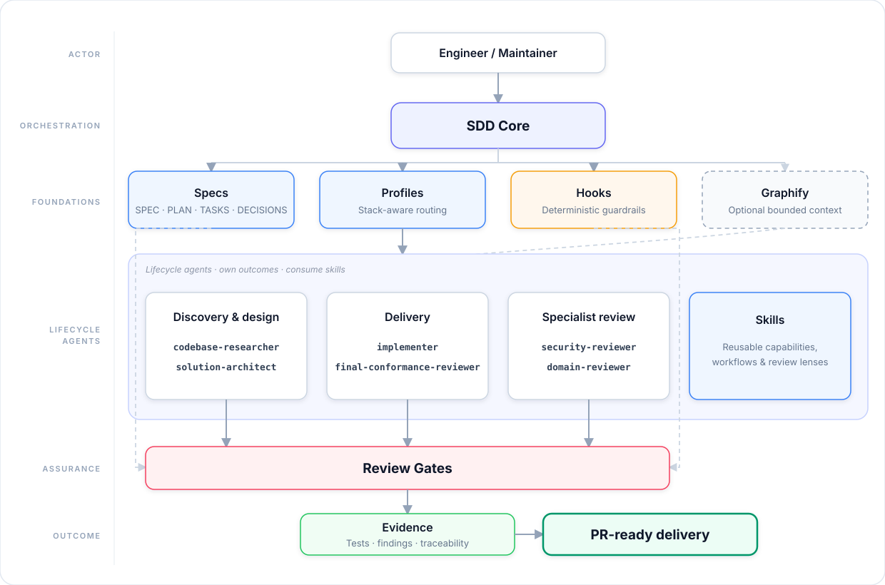
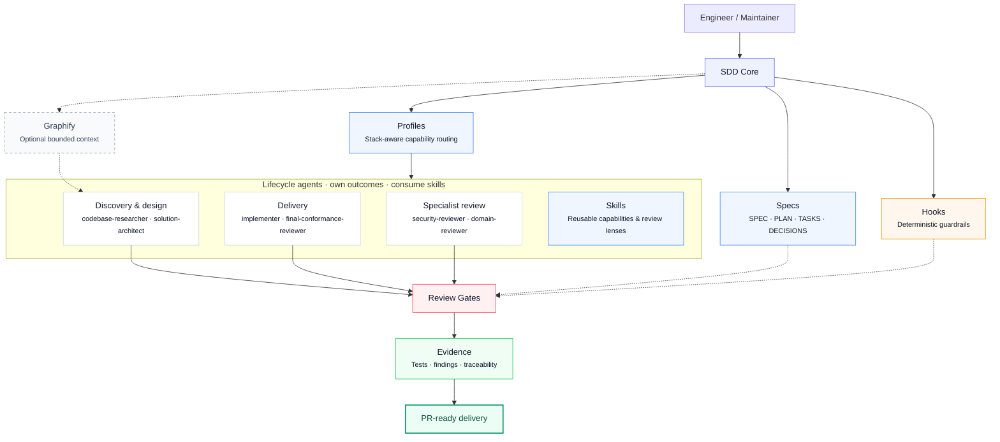
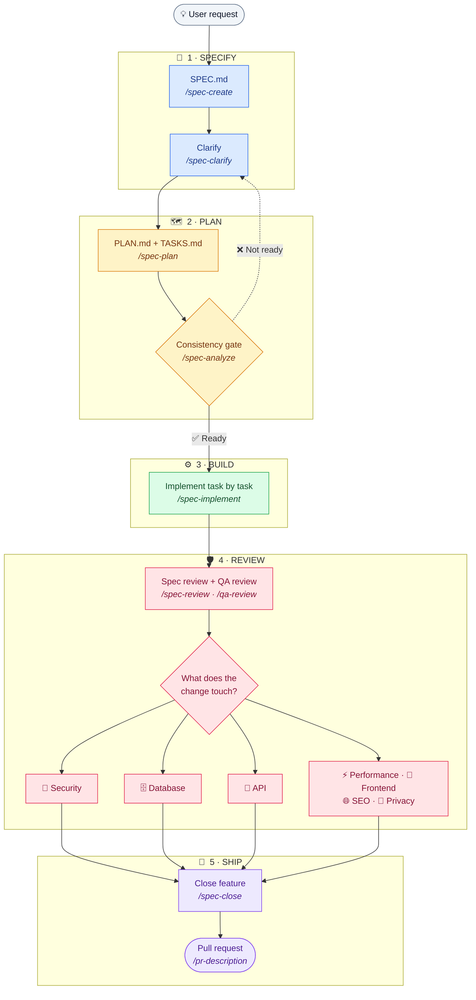
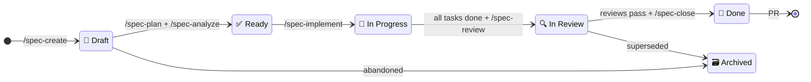
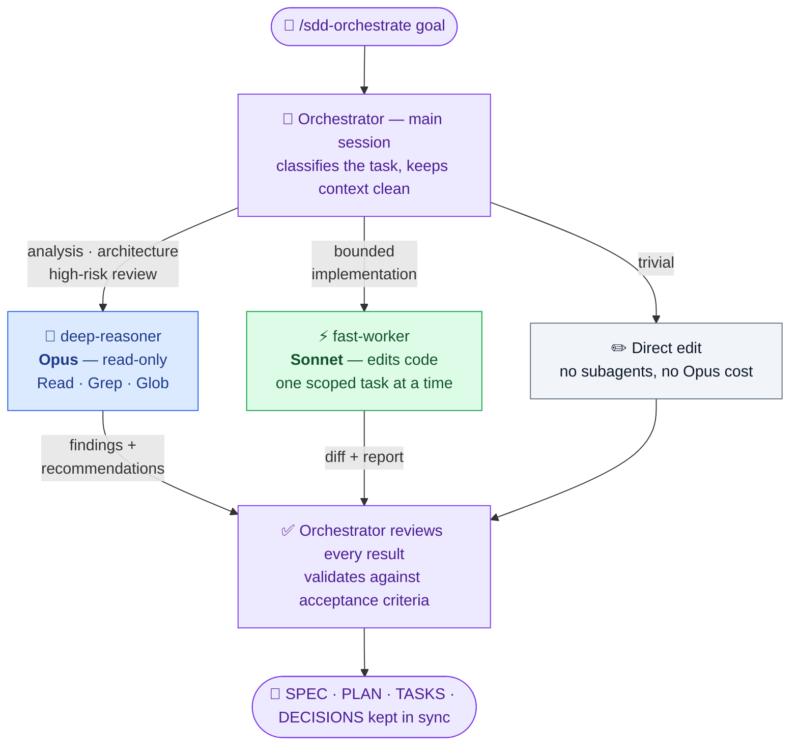
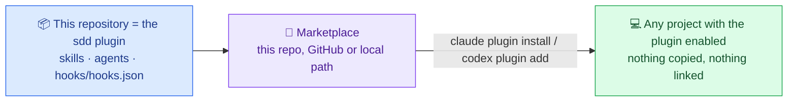
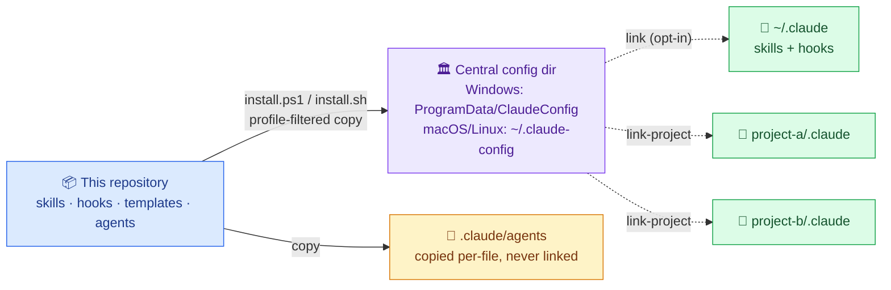
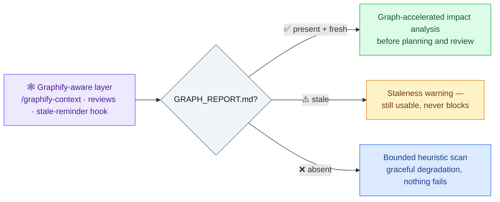

# Spec-Driven Development

**A lightweight, provider-aware engineering governance layer for AI-assisted software delivery.**

AI accelerates execution. SDD keeps delivery controlled through specs, plans, decisions, agents, skills, hooks, and verifiable review gates.

**The methodology is provider-neutral.** Its portable core — SPEC/PLAN/TASKS/DECISIONS, review gates, skill contracts, the agent responsibility model, and guardrail intent — is packaged for a specific AI coding agent by a *provider adapter*: **Claude Code** (the primary, fully featured adapter) and **Codex** (an additional, prompt-based adapter over the same core). See [Provider adapters](#provider-adapters).

**Requirement → SPEC → PLAN → TASKS → DECISIONS → Agent execution → Review gates → Evidence → PR-ready delivery**

**It installs as a plugin.** The repository root is the `sdd` plugin and the repository is its own marketplace: two commands in Claude Code, two in Codex, nothing copied into your project. The profile-aware installer remains for profile selection and Windows hooks. See [Install as a plugin](docs/INSTALL.md#install-as-a-plugin).

<div align="center">


[Quickstart](#-quickstart) · [Install as a plugin](docs/INSTALL.md#install-as-a-plugin) · [How it works](#how-it-works) · [Agents and skills](#agents-and-skills) · [Profiles](#️-profiles) · [Provider adapters](#provider-adapters) · [Current support](#current-support)

</div>

---

SDD does not make agents more autonomous. It makes AI-assisted delivery more accountable: requirements become durable artifacts, work is bounded by explicit responsibilities, and completion requires reviewable evidence.

## How it works



<details>
<summary>Mermaid source</summary>


```mermaid
flowchart TD
    classDef core fill:#eef2ff,stroke:#6366f1,color:#0f172a
    classDef found fill:#eff6ff,stroke:#3b82f6,color:#0f172a
    classDef guard fill:#fff7ed,stroke:#f59e0b,color:#0f172a
    classDef opt fill:#f8fafc,stroke:#94a3b8,stroke-dasharray:5 4,color:#334155
    classDef agent fill:#ffffff,stroke:#cbd5e1,color:#0f172a
    classDef skills fill:#eff6ff,stroke:#3b82f6,color:#0f172a
    classDef review fill:#fff1f2,stroke:#f43f5e,color:#0f172a
    classDef evidence fill:#f0fdf4,stroke:#22c55e,color:#0f172a
    classDef delivery fill:#ecfdf5,stroke:#059669,stroke-width:2px,color:#064e3b

    H["Engineer / Maintainer"] --> SDD["SDD Core"]

    SDD --> SPEC["Specs<br/><small>SPEC · PLAN · TASKS · DECISIONS</small>"]
    SDD --> PROF["Profiles<br/><small>Stack-aware capability routing</small>"]
    SDD --> HOOKS["Hooks<br/><small>Deterministic guardrails</small>"]
    SDD -.-> GRAPH["Graphify<br/><small>Optional bounded context</small>"]

    PROF --> AGENTS

    subgraph AGENTS["Lifecycle agents · own outcomes · consume skills"]
      direction LR
      DIS["Discovery &amp; design<br/><small>codebase-researcher · solution-architect</small>"]
      DEL["Delivery<br/><small>implementer · final-conformance-reviewer</small>"]
      SPC["Specialist review<br/><small>security-reviewer · domain-reviewer</small>"]
      SKILLS["Skills<br/><small>Reusable capabilities &amp; review lenses</small>"]
    end

    GRAPH -.-> DIS
    DIS --> REVIEW["Review Gates"]
    DEL --> REVIEW
    SPC --> REVIEW
    SPEC -.-> REVIEW
    HOOKS -.-> REVIEW

    REVIEW --> EVIDENCE["Evidence<br/><small>Tests · findings · traceability</small>"]
    EVIDENCE --> PR["PR-ready delivery"]

    class SDD core
    class SPEC,PROF found
    class HOOKS guard
    class GRAPH opt
    class DIS,DEL,SPC agent
    class SKILLS skills
    class REVIEW review
    class EVIDENCE evidence
    class PR delivery
```

</details>

| Layer | Responsibility |
|---|---|
| **SDD Core** | Governs `SPEC`, `PLAN`, `TASKS`, `DECISIONS`, traceability, review gates, and evidence. |
| **Lifecycle agents** | Own outcomes across research, architecture, implementation, specialist review, and final conformance. |
| **Skills** | Supply reusable workflows, checklists, review lenses, and profile-scoped capabilities. |
| **Profiles** | Activate the skills, hooks, templates, and agent routing relevant to a project stack. |
| **Hooks** | Apply deterministic tool-call guardrails; they complement review and are not a security boundary. |
| **Graphify** | Optionally supplies bounded architectural context to research; SDD works without it. |

> **Skills define how to do something. Agents are responsible for producing an outcome.**

The primary **Claude Code adapter** packages **<!-- count:skills-total -->72<!-- /count --> skills**, **<!-- count:hook-families-total -->13<!-- /count --> hook families**, **<!-- count:templates-total -->33<!-- /count --> document templates**, and **<!-- count:agents-total -->8<!-- /count --> agent definitions** behind a profile-aware installer. A second, prompt-based **Codex adapter** ([`adapters/codex/`](adapters/codex/)) packages the same provider-neutral core as an `AGENTS.md` operating guide plus lifecycle prompts — honestly, with no hook/subagent/skill parity claimed. See [Provider adapters](#provider-adapters).

## Agents and skills

SDD separates responsibility from capability. Lifecycle agents own a bounded result and invoke applicable skills; profiles decide which stack- or domain-specific skills are available to those agents.

| Lifecycle agent | Accountable outcome |
|---|---|
| `codebase-researcher` | Evidence-based map of the relevant code and constraints |
| `solution-architect` | Implementable design aligned with the approved spec |
| `implementer` | Bounded code and tests that follow the plan |
| `security-reviewer` | Vulnerability hunting (explicit taxonomy), attack anticipation, and RGPD/LOPDGDD review — severity-ranked findings and risk verdict |
| `domain-reviewer` | Stack- and domain-specific findings |
| `final-conformance-reviewer` | Final traceability, evidence, and conformance verdict |

The existing multi-model orchestration path uses a separate model-tier pair: `deep-reasoner` for read-only analysis and `fast-worker` for bounded implementation. Lifecycle agents define **what outcome is owned**; model-tier agents define **how the existing orchestration path delegates work**. See [`docs/AGENTIC_ROUTING.md`](docs/AGENTIC_ROUTING.md) and [`docs/SDD-ORCHESTRATION.md`](docs/SDD-ORCHESTRATION.md).

## Current support

| Area | Status |
|---|---|
| Plugin distribution — `sdd@spec-driven-development` for Claude Code and Codex, the repository root as plugin and marketplace | **Shipped** (spec 044; local-checkout install verified on both CLIs, inventory 72 skills / 8 agents / default hook set) |
| Claude Code adapter, installers, skills, hooks, and model-tier orchestration | **Shipped** — the installer is the alternative path: profile selection, Windows hooks, per-project Codex targets |
| Six lifecycle-agent definitions and profile routing contracts | **Shipped; schema- and dry-run validated, not yet live-install verified** |
| Java/Spring backend profile | **Default** |
| Messaging/event-driven, payments/fintech, Next/Prisma, and SEO/GEO profiles | **Optional** |
| Delivery/operations profile (deploy procedure, containers, CI/CD, release gating) | **Optional overlay.** Four reviewers shipped; `iac-review`, `kubernetes-review` and `rightsizing-advisor` declared **planned, not shipped** |
| Python/SQL/data profile (Python scripts, SQL correctness, database cost, data loads, pytest) | **Optional overlay.** Five reviewers shipped. Review only — replaces no tool, and is not data-engineering coverage |
| Blockchain/crypto profile | **Disabled placeholder** |
| Graphify integration | **Optional; Graphify itself is external** |
| Codex adapter | **Shipped as an additive, prompt-based adapter** (operating guide + lifecycle prompts + copy-only installer), plus the plugin path. `codex plugin add sdd@spec-driven-development` verified on `codex-cli 0.152.1`; the lifecycle prompts remain unverified end-to-end and no parity is claimed — see [`adapters/codex/PARITY.md`](adapters/codex/PARITY.md) |
| Other AI providers | **Conceptually compatible; add via the adapter model** in [`docs/PROVIDER_ADAPTERS.md`](docs/PROVIDER_ADAPTERS.md) |

### Provider adapters

SDD is a provider-neutral workflow with per-provider packaging. **SDD Core** — the SPEC/PLAN/TASKS/DECISIONS
lifecycle, review gates, skill contracts, agent responsibility model, guardrail intent, and bounded-context
doctrine — does not depend on any AI tool. A **provider adapter** packages that core for a specific agent:

- **Claude Code** — the primary shipped adapter; it *is* the repository root (`skills/`, `agents/`, `hooks/`,
  installers, settings templates), and since spec 044 that root is also the `sdd` plugin (`.claude-plugin/`, `hooks/hooks.json`). Nothing was moved. Pointer: [`adapters/claude/README.md`](adapters/claude/README.md).
- **Codex** — a first, honest, prompt-based adapter under [`adapters/codex/`](adapters/codex/): an `AGENTS.md`
  operating guide, the lifecycle-spine prompts, and a self-contained copy-only installer. It reuses the same
  `specs/_templates/`. It does **not** claim parity — no enforced hooks, no native subagents, no profile-filtered
  install. Its lifecycle prompts are unverified end-to-end; the plugin install into Codex is verified
  (`.codex-plugin/plugin.json`, spec 044). The gaps are stated in [`adapters/codex/PARITY.md`](adapters/codex/PARITY.md).

The shortest path for either host is the plugin: `claude plugin marketplace add <repo>` + `claude plugin install sdd@spec-driven-development`, or the `codex plugin` equivalents ([details and caveats](docs/INSTALL.md#install-as-a-plugin)). The scripts below remain for profile selection, Windows hooks and per-project Codex `AGENTS.md`.

Both adapters also install with independent, idempotent scripts (they touch disjoint locations and never
overlap). To install both first-time, a thin convenience wrapper calls each in order — it does not
modify or reimplement either installer:

```bash
./install-all.sh --dry-run                       # preview both, writes nothing
./install-all.sh --codex-target /path/to/project # Claude (install.sh) then Codex (install-codex.sh)
./install-all.sh --skip-codex                     # only Claude   ·   --skip-claude → only Codex
.\install-all.ps1 -CodexTarget C:\code\my-app     # Windows twin
```

Because each installer is idempotent, re-running adds only what is missing for that adapter. There is
no single "install the rest" detection — you pick which adapters to run. `--codex-target` is what
installs the per-project `AGENTS.md`; without it the Codex **prompts** still install globally but
`AGENTS.md` is skipped (it is never written into the current directory or the framework repo).

Model and rationale: [`docs/PROVIDER_ADAPTERS.md`](docs/PROVIDER_ADAPTERS.md) · registry and capability matrix:
[`adapters/README.md`](adapters/README.md).

---

## Table of contents

- [🧩 What is this?](#-what-is-this)
- [🎯 Why it exists](#-why-it-exists)
- [How it works](#how-it-works)
- [Agents and skills](#agents-and-skills)
- [Current support](#current-support)
- [🚀 Quickstart](#-quickstart)
- [🔄 Core workflow](#-core-workflow)
- [🌐 Workspace SDD](#-workspace-sdd)
- [🧠 Multi-model orchestration](#-multi-model-orchestration)
- [🏗️ Repository architecture](#️-repository-architecture)
- [🗂️ Profiles](#️-profiles)
- [⚙️ Installation](#️-installation)
- [💻 Usage examples](#-usage-examples)
- [📚 Worked examples](#-worked-examples)
- [🛡️ Safety model](#️-safety-model)
- [📊 What is shipped now](#-what-is-shipped-now)
- [🗺️ Roadmap](#️-roadmap)
- [📐 Design principles](#-design-principles)
- [✍️ Author's note](#️-authors-note)
- [⚠️ Limitations](#️-limitations)
- [📄 License](#-license)

---

## 🧩 What is this?

A **provider-neutral Spec-Driven Development (SDD) workflow for AI-assisted software engineering** — shipped primarily as installable Claude Code configuration, with an additional prompt-based [Codex adapter](#provider-adapters) over the same core. It is the reproducible sequence that sits between "having an idea" and "opening a pull request":

**specification → clarification → planning → consistency analysis → scoped implementation → layered review → close-out.**

Five kinds of artifacts implement it:

| Artifact | What it is | Where |
|---|---|---|
| **Skills** | Slash commands that drive each workflow step (`/spec-create`, `/spec-plan`, `/security-review`, …) as structured, repeatable procedures | [`skills/`](skills/) |
| **Hooks** | Small scripts Claude Code runs at tool-call level — they can block a destructive git command or surface a compile error *before* the session moves on | [`hooks/`](hooks/) |
| **Profiles** | A manifest ([`profiles.json`](profiles.json)) mapping stacks (Java/Spring, Next.js, messaging, …) to the skills/hooks/templates/agents they need, consumed by the installers | repo root |
| **Templates** | Starter documents for specs, plans, tasks, decisions, and project context docs | [`specs/_templates/`](specs/_templates/), [`docs/_templates/`](docs/_templates/) |
| **Agents** | Six lifecycle responsibility contracts plus the `deep-reasoner` / `fast-worker` model-tier pair used by the existing orchestration path | [`agents/`](agents/) |

> These five artifacts are the **Claude Code** adapter's packaging. Codex consumes the same provider-neutral core through a different packaging — an `AGENTS.md` operating guide plus lifecycle prompts under [`adapters/codex/`](adapters/codex/), with guardrails as conventions rather than enforced hooks. See [Provider adapters](#provider-adapters).

It is not a demo. It is the process used to build real features in real codebases, where an unreviewed change to auth, payments, or a database schema is expensive to get wrong. The AI writes a meaningful share of the code — that part isn't in question. What this repo adds is the structure around that code, and the tooling that makes the structure hard to skip.

## 🎯 Why it exists

AI coding without process has a failure mode every team has now seen: requirements live in chat scrollback, the model makes silent architectural decisions, plans drift from what was actually built, and review happens (if at all) as a vibe check on a diff nobody scoped. The result is ambiguity, regressions, and hidden debt — produced faster than ever.

This workflow addresses that directly:

- **A written spec before implementation starts** — with explicit out-of-scope boundaries and acceptance criteria.
- **An explicit plan before files change** — impacted modules, risks, rollback strategy.
- **A consistency gate before tasks are marked done** — spec, plan, tasks, and decisions must agree.
- **Reviews scoped to what the change actually touches** — a schema change gets a database review; a UI-only change doesn't.
- **Decisions written down** — every non-obvious choice lands in `DECISIONS.md` with its reasoning, instead of living only in a conversation that will be compacted away.
- **Enforcement in tooling, not just prose** — hooks intervene at tool-call level (see [Safety model](#️-safety-model)).

The engineer decides what gets built, what risk is acceptable, and which changes should not happen. The AI executes within the process — it does not own it. This is the difference from vibe coding: speed comes from reducing ambiguity, not skipping engineering controls.

It also addresses a cost shift. AI coding tools are moving from seat-based to usage-based (per-token) pricing, where the bill tracks how much context an agent reads and which model tier it burns. SDD treats context as an engineering budget — bounded reading lists, graph-derived impact, and cost-aware model routing instead of loading the whole repository on an expensive model. That makes delivery cheaper and more reviewable at the same time (see [`docs/TOKEN_ECONOMY.md`](docs/TOKEN_ECONOMY.md)).

## 🚀 Quickstart

**Install as a plugin** — Claude Code or Codex, two commands, nothing copied into your project:

```bash
# Claude Code — from GitHub, or replace the repo with a local clone path
claude plugin marketplace add manujc00005/spec-driven-development
claude plugin install sdd@spec-driven-development
```

```bash
# Codex
codex plugin marketplace add https://github.com/manujc00005/spec-driven-development
codex plugin add sdd@spec-driven-development
```

That loads the 72 skills, the 8 agents and the default hook set (`hooks/hooks.json`). Read the five caveats before you choose this path — Windows hooks, double wiring, duplicated skills, in-place loading, what you are trusting: [Install as a plugin](docs/INSTALL.md#install-as-a-plugin).

**Alternative — the profile-aware installer.** Use it when you want a subset of profiles, Windows hooks, or a per-project Codex `AGENTS.md`:

```bash
git clone https://github.com/manujc00005/spec-driven-development.git
cd spec-driven-development

./install.sh --dry-run          # macOS/Linux (requires python3) — preview, writes nothing
.\install.ps1 -DryRun           # Windows

./install.sh                    # core + default profile into the central config dir
./install.sh --link-user-claude # opt-in: link ~/.claude (skills, hooks) + copy agents
./install-all.sh --codex-target <your-project>   # both adapters; writes the per-project AGENTS.md
./scripts/wire-hooks.sh --project-dir <your-project>  # wire the hooks into one project's settings
./scripts/update.sh             # later: git pull + re-install + "what's new" report
```

Do not combine both paths on one machine: the plugin and `--link-user-claude` would list every skill twice, and the plugin plus `wire-hooks` would fire every hook twice.

Then, in any project, start a new Claude Code session and run:

```
/project-init        # once per project — creates specs/CONSTITUTION.md
/sdd "Add rate limiting to the public checkout API"
```

Full walkthrough, per-project linking, and verification steps: [`docs/INSTALL.md`](docs/INSTALL.md).

---

## 🔄 Core workflow


```mermaid
flowchart TD
    A(["💡 User request"]) --> C

    subgraph P1["📝 &nbsp;1 · SPECIFY"]
        direction TB
        C["SPEC.md<br/><i>/spec-create</i>"] --> D["Clarify<br/><i>/spec-clarify</i>"]
    end

    subgraph P2["🗺️ &nbsp;2 · PLAN"]
        direction TB
        E["PLAN.md + TASKS.md<br/><i>/spec-plan</i>"] --> F{"Consistency gate<br/><i>/spec-analyze</i>"}
    end

    subgraph P3["⚙️ &nbsp;3 · BUILD"]
        G["Implement task by task<br/><i>/spec-implement</i>"]
    end

    subgraph P4["🛡️ &nbsp;4 · REVIEW"]
        direction TB
        H["Spec review + QA review<br/><i>/spec-review · /qa-review</i>"] --> I{"What does the<br/>change touch?"}
        I --> R1["🔐 Security"]
        I --> R2["🗄️ Database"]
        I --> R3["🔌 API"]
        I --> R4["⚡ Performance · 🎨 Frontend<br/>🌐 SEO · 🔏 Privacy"]
    end

    subgraph P5["🚀 &nbsp;5 · SHIP"]
        direction TB
        J["Close feature<br/><i>/spec-close</i>"] --> K(["Pull request<br/><i>/pr-description</i>"])
    end

    D --> E
    F -->|"✅ Ready"| G
    F -.->|"❌ Not ready"| D
    G --> H
    R1 --> J
    R2 --> J
    R3 --> J
    R4 --> J

    classDef entry fill:#f1f5f9,stroke:#64748b,color:#0f172a
    classDef spec fill:#dbeafe,stroke:#2563eb,color:#1e3a8a
    classDef plan fill:#fef3c7,stroke:#d97706,color:#78350f
    classDef build fill:#dcfce7,stroke:#16a34a,color:#14532d
    classDef review fill:#ffe4e6,stroke:#e11d48,color:#881337
    classDef ship fill:#ede9fe,stroke:#7c3aed,color:#4c1d95

    class A entry
    class C,D spec
    class E,F plan
    class G build
    class H,I,R1,R2,R3,R4 review
    class J,K ship
```

Each step is a real skill invoked as a slash command. The core lifecycle:

| Command | Purpose | Output |
|---|---|---|
| `/project-init` | Create the project's engineering constitution (stack, conventions, mandatory reviews) | `specs/CONSTITUTION.md` |
| `/sdd` | Main entry point — auto-detects complexity, drives spec → plan → analyze | Whole pre-implementation chain |
| `/spec-create` | Create the feature specification, with an automatic clarification pass | `SPEC.md` (status `Draft`) |
| `/spec-clarify` | Deeper clarification pass when blocking questions remain | Updated `SPEC.md` |
| `/spec-plan` | Convert an approved spec into a plan, task list, and decision log | `PLAN.md`, `TASKS.md`, `DECISIONS.md` |
| `/spec-analyze` | Validate consistency across all four documents; detect which specialized reviews apply | Readiness verdict + findings |
| `/spec-implement` | Implement the next scoped task, test-driven, one task at a time | Code + tests, updated `TASKS.md` |
| `/spec-review` | Review the implementation against spec, plan, and tasks | Review verdict |
| `/qa-review` | Functional behavior, edge cases, regressions | QA verdict |
| `/spec-close` | Resolve open questions, confirm acceptance-criteria coverage, close the feature | Implementation summary |
| `/pr-description` | Generate the pull request description from the diff and the spec | PR text |

Specialized reviews are triggered by what the spec declares, not run blindly: `/security-review`, `/database-review`, `/api-review`, `/backend-review`, `/frontend-review`, `/performance-review`, `/seo-review`, `/privacy-compliance-review`. Delivery reviews are the exception — `/deployment-review`, `/container-review` and `/pipeline-review` are triggered by **artifact presence**, not by spec wording, and `/release-readiness` is a release gate run once rather than per diff (see [Profiles](#️-profiles)). Supporting commands cover the rest of the lifecycle: `/sdd-guardrails` (consistency gate), `/spec-status`, `/spec-update`, `/spec-resume`, `/review-all`, `/architect-review`, `/test-engineer`, `/debugger`, `/prototype`, `/decision-mapping`, `/refactor-review`, `/handoff`, `/context-manager`, `/graphify-context`, `/sdd-onboard`, `/sdd-workspace-init`, plus the stack-specific reviewers listed under [Profiles](#️-profiles). Every command in this README exists as a `SKILL.md` file in [`skills/`](skills/) — every one of them; none are aspirational.

#### Mindset skills

The process skills above tell a model *what steps to run*; these nine tell it *how to think* while running them — actionable rules, named anti-patterns, and a self-check, not personality prose. Invoke them explicitly (`/verifier`, …) or read them as manuals:

- `/verifier` — "done" means observed working end-to-end, not "it compiles".
- `/scope-keeper` — do exactly what was asked: minimal diff, no drive-by refactors, code that reads like its neighbors.
- `/communicator` — lead with the outcome, full sentences over fragments and arrow-chains, selectivity over compression.
- `/stopper` — proceed on reversible actions, stop for destructive ones, never end a turn promising work instead of doing it.
- `/honest-advisor` — correct a flawed premise instead of complying; one recommendation, not a menu; bad news at full strength.
- `/threat-modeler` — attacker mindset while writing code ("who can call this, worst-case input?"); complements `/security-review`.
- `/scout` — orient before editing: read structure, search before building, derive conventions from the code; complements `/sdd-onboard`.
- `/decomposer` — decompose before coding, find the one irreversible decision, skip planning when trivial; complements `/spec-plan`.
- `/root-causer` — reproduce before hypothesizing, fix the cause not the symptom; complements `/debugger`.

### Spec status lifecycle


```mermaid
stateDiagram-v2
    direction LR
    state "📝 Draft" as Draft
    state "✅ Ready" as Ready
    state "🔨 In Progress" as InProgress
    state "🔍 In Review" as InReview
    state "🏁 Done" as Done
    state "🗃️ Archived" as Archived

    [*] --> Draft : /spec-create
    Draft --> Ready : /spec-plan + /spec-analyze
    Ready --> InProgress : /spec-implement
    InProgress --> InReview : all tasks done + /spec-review
    InReview --> Done : reviews pass + /spec-close
    Done --> [*] : PR
    Draft --> Archived : abandoned
    InReview --> Archived : superseded
```

Implementation cannot start against a `Draft` spec, and a feature cannot close from anything other than `In Review`. These checks live in the skills themselves (`spec-implement` and `spec-close` refuse to proceed on a wrong status), not in convention.

Not every change goes through the full ceremony: typo fixes, small styling tweaks, and isolated one-line bug fixes are handled directly. The workflow is reserved for changes where the cost of being wrong justifies the cost of the process.

---

## 🌐 Workspace SDD

SDD scales from one project to a **folder of related projects** — backend, widget, shared SDK, admin frontend — where a single feature routinely lands in several of them at once. **`/sdd-workspace-init`** takes such a folder to a fully-wired state in one pass: detect the projects (and confirm the list — which repos participate is a decision, not an inference), refresh each project's Graphify graph, write the `.sdd-workspace/` map, install the state machinery, and link every child project back to the workspace layer.

**The principle the layer is built on: state is generated; rules are written.** Documentation that *copies* state — versions, spec counts, what is in progress — goes stale within days and then misleads with the authority of a governance document. So the map records structure and evidence, and three deterministic scripts (no model calls, same tree → same output) derive the rest:

| Script | Answers | Guarantee |
|---|---|---|
| `board.mjs` | What is active across every project, what is blocked and by whom | Derived from spec headers — it can only be wrong if a spec is wrong |
| `drift.mjs` | Do the governance documents still match the files they cite? | Compares claims against the data files that own them |
| `link-workspace.mjs` | Does each child project know it belongs to a workspace? | Idempotent delimited block in each repo's instruction file |

That last one closes a gap worth naming, because it is invisible until it bites: the map alone lives at the workspace root, while most sessions open *inside* a repository — where none of it is visible. Linking is what makes the governance layer reachable from where work actually happens.

**Two rules carry the cross-project workflow.** A feature gets a workspace-level parent spec **only if it moves a shared contract or requires ordering between repos**; otherwise it is sibling specs in each repo, linked by a `Blocked-by:` field, with no ceremony. And closure splits in two: `Merged` means the code is in `main` with every task accounted for; `Live` means someone verified the behaviour in production and pasted the evidence. Conflating them is how a repository accumulates features that are "done" but never switched on.

Token cost is why the layer exists at all: **Graphify runs per project**, and the workspace consumes each project's bounded `GRAPH_REPORT.md` — never the raw graph file, never a repository in full. Every cross-project feature starts with an `IMPACT_MAP.md`, and no project outside that map may be modified.

> Graphify maps code-level dependencies. Workspace SDD maps project-level dependencies.

The machinery shipped here is an extraction, not a design exercise: it was built, debugged and left running in a six-project workspace before being generalized into templates. `/sdd-workspace-onboarding` remains available on its own for the mapping phase alone.

Full guide: [`docs/WORKSPACE_SDD.md`](docs/WORKSPACE_SDD.md) · templates in [`docs/_templates/`](docs/_templates/) and [`skills/sdd-workspace-init/templates/`](skills/sdd-workspace-init/templates/).

---

## 🧠 Multi-model orchestration

The workflow can run in an orchestrated multi-model mode via **`/sdd-orchestrate <goal>`**, which splits work across models by what each is actually good (and priced) for:


```mermaid
flowchart TD
    U(["🎯 /sdd-orchestrate goal"]) --> O["🧠 Orchestrator — main session<br/>classifies the task, keeps context clean"]

    O -->|"trivial"| T["✏️ Direct edit<br/>no subagents, no Opus cost"]
    O -->|"analysis · architecture<br/>high-risk review"| DR["🔬 deep-reasoner<br/><b>Opus</b> — read-only<br/>Read · Grep · Glob"]
    O -->|"bounded<br/>implementation"| FW["⚡ fast-worker<br/><b>Sonnet</b> — edits code<br/>one scoped task at a time"]

    DR -->|"findings +<br/>recommendations"| V
    FW -->|"diff + report"| V
    T --> V

    V["✅ Orchestrator reviews every result<br/>validates against acceptance criteria"]
    V --> S(["📄 SPEC · PLAN · TASKS · DECISIONS kept in sync"])

    classDef main fill:#ede9fe,stroke:#7c3aed,color:#4c1d95
    classDef opus fill:#dbeafe,stroke:#2563eb,color:#1e3a8a
    classDef sonnet fill:#dcfce7,stroke:#16a34a,color:#14532d
    classDef cheap fill:#f1f5f9,stroke:#64748b,color:#0f172a

    class U,O,V,S main
    class DR opus
    class FW sonnet
    class T cheap
```

| Role | Model | Responsibility |
|---|---|---|
| **Orchestrator** | Main session (Fable when available, otherwise your session model) | Classify the task, keep context clean, write briefs, review every result, validate against acceptance criteria |
| **`deep-reasoner`** | Opus (read-only: `Read`, `Grep`, `Glob`) | Architecture, root cause, security, concurrency, migrations, high-risk review — analyzes and recommends, structurally cannot edit |
| **`fast-worker`** | Sonnet (can edit) | Implements one bounded task at a time; stops and reports if it hits an undocumented architectural decision instead of guessing |

Key properties:

- **Cost-aware routing** — trivial changes never touch Opus; four task-classification levels decide the flow.
- **Analysis-only mode** — "audit"/"investigate" requests produce a prioritized report and implement nothing.
- **No overlapping parallel edits** — parallel `fast-worker` tasks are allowed only when file/contract/migration/state overlap is impossible.
- **Documented fallback policy** — model names are aliases (`opus`, `sonnet`), and there is an explicit fallback table for when Fable, Opus, or Sonnet is unavailable on your account. No configuration ever pins an invented model ID.
- **Honest verification status** — shipped, structurally verified (frontmatter, tools, idempotent install), and **live-verified**: a fresh Claude Code session after a real deploy recognized both agents with the correct models and the `/sdd-orchestrate` command (2026-07-13; procedure and evidence in [`specs/features/004-multimodel-orchestration/`](specs/features/004-multimodel-orchestration/)). The distinction between structural and live verification was tracked explicitly until the live check passed.

Full documentation — architecture, task classification, cost control, fallback, install, rollback: [`docs/SDD-ORCHESTRATION.md`](docs/SDD-ORCHESTRATION.md).

---

## 🏗️ Repository architecture

```
spec-driven-development/
├── README.md
├── LICENSE                        # MIT
├── profiles.json                  # profile manifest — the installer's source of truth
├── CLAUDE.md.example              # sanitized project instructions — copy/merge into your own CLAUDE.md
├── .claude-plugin/                # plugin.json + marketplace.json — the repo root IS the `sdd` plugin and its marketplace (spec 044)
├── .codex-plugin/                 # the same identity for Codex
├── settings.template.json         # hook wiring template — Windows (PowerShell commands)
├── settings.template.sh.json      # hook wiring template — macOS/Linux (bash commands, same hook set)
├── install.ps1 / install.sh       # profile-aware installers (Claude adapter — central config dir + optional ~/.claude linking)
├── install-all.ps1 / .sh          # convenience wrapper — installs both adapters by calling each installer in order
├── link-project.ps1 / .sh         # link one project's .claude/ to the central dir
├── adapters/                      # provider-adapter layer — claude/ (pointer to this root) + codex/ (prompt-based adapter)
├── skills/                        # 72 skills — one folder per slash command
├── hooks/                         # 13 hook families × (.ps1 + .sh) = 26 scripts
│   ├── hooks.json                 # the plugin's wiring — same default set as the bash template, `${CLAUDE_PLUGIN_ROOT}` paths, gate-enforced equivalence
│   ├── README.md                  # per-hook trigger, effect, and activation guide
│   └── lib/claude-json.sh         # dependency-free JSON helper for .sh hooks (no jq, no python)
├── agents/                        # 6 lifecycle agents + deep-reasoner.md (Opus) + fast-worker.md (Sonnet) — agent files only; their README is docs/AGENTS.md so the plugin loader does not ship it as an agent
├── docs/
│   ├── INSTALL.md                 # install guide — plugin first, then the scripts (Windows, macOS/Linux)
│   ├── AGENTS.md                  # the agents reference (moved from agents/README.md, spec 044)
│   ├── AUTONOMOUS_SDD_FEATURE_PROMPT.md  # delivers a feature autonomously to a PR through gates G0–G8 — the supported autonomous path
│   ├── TOKEN_ECONOMY.md           # bounded-context contract
│   ├── WORKSPACE_SDD.md           # the .sdd-workspace/ layer for folders of related projects
│   ├── KNOWN_DEBT.md              # accepted, unverified claims — one entry each
│   ├── SDD-ORCHESTRATION.md       # multi-model orchestration reference
│   ├── AGENTIC_ROUTING.md         # lifecycle-agent reference: skills vs. agents, routing model
│   ├── PROVIDER_ADAPTERS.md       # SDD Core vs. provider adapters — the provider-neutral/adapter boundary
│   ├── ROADMAP_JAVA_SPRING_CONTEXT.md  # original phase-planning document (historical)
│   └── _templates/                # 21 project-context doc templates (PROJECT_CONTEXT, TECH_STACK,
│                                  #   ARCHITECTURE, TESTING, SECURITY, DEPLOYMENT, RUNBOOK,
│                                  #   MESSAGING, MICROSERVICES_PATTERNS, GRAPHIFY, PROJECT_GRAPH,
│                                  #   + 10 WORKSPACE_* templates for the .sdd-workspace/ layer)
├── runner/                        # maintainer tooling, FROZEN at spec 042 (runner/README.md) — not plugin content, not installed
├── scripts/                       # check-consistency (the CI gate), update, wire-hooks, personal-config, skill-eval
├── specs/
│   ├── _templates/                # 12 SDD lifecycle templates (SPEC, PLAN, TASKS, DECISIONS,
│   │                              #   CONSTITUTION, SERVICES, PR_DESCRIPTION, REVIEW_REPORT_TEMPLATE, …)
│   └── features/                  # this repo's own features, built with its own workflow (dogfooding)
└── examples/                      # worked end-to-end examples (payment webhook idempotency)
```

How content reaches a project — two paths, pick one per machine:


```mermaid
flowchart LR
    R2["📦 This repository = the sdd plugin<br/>skills · agents · hooks/hooks.json"]
    M["🛒 Marketplace<br/>this repo, GitHub or local path"]
    S1["💻 Any project with the plugin enabled<br/>nothing copied, nothing linked"]
    R2 --> M -->|"claude plugin install / codex plugin add"| S1
    classDef repo fill:#dbeafe,stroke:#2563eb,color:#1e3a8a
    classDef mk fill:#ede9fe,stroke:#7c3aed,color:#4c1d95
    classDef consumer fill:#dcfce7,stroke:#16a34a,color:#14532d
    class R2 repo
    class M mk
    class S1 consumer
```

A directory-sourced marketplace loads the checkout in place; a GitHub-sourced one goes through the plugin cache. The installer path is the alternative, for profile selection and Windows hooks:


```mermaid
flowchart LR
    R["📦 This repository<br/>skills · hooks · templates · agents"]
    C["🏛️ Central config dir<br/>Windows: ProgramData/ClaudeConfig<br/>macOS/Linux: ~/.claude-config"]
    U["👤 ~/.claude<br/>skills + hooks"]
    P1["📁 project-a/.claude"]
    P2["📁 project-b/.claude"]
    AG["🤖 .claude/agents<br/>copied per-file, never linked"]

    R -->|"install.ps1 / install.sh<br/>profile-filtered copy"| C
    C -.->|"link (opt-in)"| U
    C -.->|"link-project"| P1
    C -.->|"link-project"| P2
    R -->|"copy"| AG

    classDef repo fill:#dbeafe,stroke:#2563eb,color:#1e3a8a
    classDef central fill:#ede9fe,stroke:#7c3aed,color:#4c1d95
    classDef consumer fill:#dcfce7,stroke:#16a34a,color:#14532d
    classDef agents fill:#fef3c7,stroke:#d97706,color:#78350f

    class R repo
    class C central
    class U,P1,P2 consumer
    class AG agents
```

- The **central config directory** (Windows: `C:\ProgramData\ClaudeConfig`; macOS/Linux: `~/.claude-config` by default) receives a profile-filtered copy of skills, hooks, templates, and agents.
- `~/.claude/skills` and `~/.claude/hooks` (and per-project `.claude/skills|hooks`) are **linked** (junction/symlink) to the central dir — update the central dir once, every consumer sees it.
- **Agents are the deliberate exception: copied per-file, never linked**, because `.claude/agents` directories commonly contain user-authored agents that a directory link would hide. Consequence: re-run the installer after `git pull` to refresh agents.
- `CLAUDE.md` and `settings.json` are **never written directly** — only `CLAUDE.md.example` and `settings.template.json` ship, and merging them into your real config is an explicit manual step.

---

## 🗂️ Profiles

Profiles control which skills, hooks, templates, and agents get installed, declared in [`profiles.json`](profiles.json):

| Profile | Status | What it adds |
|---|---|---|
| `core` | Always installed | Full SDD lifecycle, guardrails, generic reviews, orchestration (<!-- count:core-skills -->43<!-- /count --> skills, <!-- count:core-hooks -->7<!-- /count --> hooks, <!-- count:core-templates -->27<!-- /count --> templates, <!-- count:core-agents -->8<!-- /count --> agents) |
| `java-spring-backend` | **Default** | <!-- count:java-spring-backend-skills -->8<!-- /count --> review skills (JPA/transactions, Spring REST, Spring Security, JVM performance, observability, database, API, backend), <!-- count:java-spring-backend-hooks -->3<!-- /count --> hooks, <!-- count:java-spring-backend-templates -->6<!-- /count --> context templates. Maven primary, Gradle fallback |
| `messaging-event-driven` | Optional | `event-driven-reviewer` (Kafka/RabbitMQ/ActiveMQ, outbox, saga, DLQ) + `microservices-patterns-reviewer` (boundaries, resilience, contracts), <!-- count:messaging-event-driven-templates -->2<!-- /count --> templates |
| `next-prisma-web` | Optional | Frontend/privacy/database reviews + `prisma-migration-reviewer` (generated-SQL safety) + `nextjs-server-actions-reviewer` (action = public endpoint) + `ts-check`/`eslint-fix`/`prettier-format` hooks (`prisma-migration-guard` hook still planned) |
| `seo-geo-addon` | Optional overlay, billable | Full SEO family: `seo-review` (technical on-page + hreflang), `aeo-review` (answer extraction), `geo-review` (generative-engine citability), `ai-visibility-review` (AI-crawler access policy). Every skill gates on the service being contracted in `specs/SERVICES.md`. Install only when SEO/GEO/AEO/AI-visibility is a contracted service |
| `payments-fintech` | Optional overlay | `stripe-payments-reviewer` (webhooks, idempotency keys, minor units, key hygiene) + `payment-idempotency-reviewer` (processor-agnostic exactly-once effects). `stripe-review-reminder` hook still planned |
| `delivery-operations` | Optional overlay | <!-- count:delivery-operations-skills -->4<!-- /count --> skills covering how code reaches a machine and stays alive there: `deployment-review` (step ordering, idempotency, re-run after partial failure, rollback), `container-review` (image pinning, port binding as the real perimeter, root, volumes, build-arg secrets), `pipeline-review` (what CI verifies vs what its job names imply), `release-readiness` (a Go/No-go gate asking what was *rehearsed*, not what exists) + <!-- count:delivery-operations-templates -->2<!-- /count --> templates (`RUNBOOK.md`, `DEPLOYMENT.md`). `iac-review`, `kubernetes-review` and `rightsizing-advisor` are declared **planned, not shipped** — see spec 024 D004/D005/D013 |
| `python-sql-data` | Optional overlay | <!-- count:python-sql-data-skills -->5<!-- /count --> review skills for Python + SQL work: `python-reviewer` (structure, failing loudly, config/IO separation), `sql-query-reviewer` (join fan-out, NULL semantics, parameterization), `database-performance-reviewer` (index coverage, N+1, locks, the write cost of a new index), `data-pipeline-reviewer` (idempotency, partial failure, watermarks, timezones), `python-testing-reviewer` (pytest determinism and isolation). Review only — it replaces no tool (`ruff`, `mypy`, `pytest`, `sqlfluff`, `EXPLAIN`) and is not data-engineering coverage. See [`docs/PYTHON_SQL_PROFILE.md`](docs/PYTHON_SQL_PROFILE.md) |
| `blockchain-crypto` | **Disabled** | Placeholder. The installer refuses to install it — requesting it explicitly is a hard error by design |

Rules the installers enforce:

- **`core` is always installed.** With no `--profile`/`-Profile` flag, you get `core` + the default (`java-spring-backend`). The moment you pass any explicit profile, you get `core` + exactly what you asked for — no silent default stacking.
- **Profiles combine explicitly.** `messaging-event-driven` assumes a Java/Spring service underneath but is *not* an automatic overlay — to get both: `--profile java-spring-backend,messaging-event-driven`.
- **Shipped vs. planned is a hard distinction.** `skills`/`hooks`/`templates`/`agents` entries must exist on disk — a missing one is a manifest-integrity error (exit 1), never a silent skip. `planned*` entries are roadmap-only, reported as `[planned] … not installed`, never an error.
- **No guessing.** Unknown profile name, explicitly requested disabled profile, or unparsable `profiles.json` → clear `[ERROR]`, non-zero exit, no fallback to "install everything".
- **Billable scope is explicit.** `seo-geo-addon` (and any future paid add-on) is never bundled into a base profile — it installs only via `--profile next-prisma-web,seo-geo-addon`, matching a client actually having contracted the service in `specs/SERVICES.md`. See the Billing boundary section in `specs/_templates/CONSTITUTION.md`.

Beyond `skills`/`hooks`/`templates`/`agents`, each non-core profile also declares an additive
`agentRouting` map — which of its reviewer skills `domain-reviewer` or `security-reviewer`
own for that stack (e.g. `java-spring-backend` routes `spring-security-reviewer` to
`security-reviewer` and the rest of its reviewers to `domain-reviewer`). Full model:
[`docs/AGENTIC_ROUTING.md`](docs/AGENTIC_ROUTING.md).

---

## ⚙️ Installation

**The plugin is the primary path.** `claude plugin marketplace add <this repo>` then `claude plugin install sdd@spec-driven-development`; `codex plugin marketplace add` and `codex plugin add sdd@spec-driven-development` for Codex. Inventory and projected token cost: `claude plugin details sdd`. Caveats and the Codex commands: [Install as a plugin](docs/INSTALL.md#install-as-a-plugin).

**The installer is the alternative** — for a subset of profiles, for Windows hooks (the plugin wires the bash hooks only), and for a per-project Codex `AGENTS.md`. It is split across a few small, single-purpose scripts — full guide in [`docs/INSTALL.md`](docs/INSTALL.md):

| Concern | Script | Touches |
|---|---|---|
| Install into a central config dir | `install.ps1` / `install.sh` | Central directory only, by default |
| Link your per-user `~/.claude` | same scripts, `-LinkUserClaude` / `--link-user-claude` | `~/.claude` — **opt-in** |
| Link one project | `link-project.ps1` / `link-project.sh` | `<project>/.claude` only |
| Install **both** adapters (Claude + Codex) | `install-all.ps1` / `install-all.sh` | Calls both installers in order; disjoint locations |
| Install the Codex adapter alone | `adapters/codex/install-codex.ps1` / `.sh` | Project-root `AGENTS.md` + `~/.codex/prompts/` |

The last two are the **provider-adapter layer** (see [Provider adapters](#provider-adapters) above and [`docs/PROVIDER_ADAPTERS.md`](docs/PROVIDER_ADAPTERS.md)). `install-all` does not modify or reimplement the Claude installers — it only calls them — and each installer stays independently idempotent.

**Windows**

```powershell
.\install.ps1 -DryRun                                        # preview, writes nothing
.\install.ps1                                                # install into C:\ProgramData\ClaudeConfig
.\install.ps1 -Profile java-spring-backend,messaging-event-driven
.\install.ps1 -LinkUserClaude                                # opt-in ~/.claude linking + agent copy
.\link-project.ps1 -ProjectDir C:\code\my-app                # wire one project
```

**macOS/Linux** — requires `python3` (standard-library `json` only; `jq` is *not* used anywhere):

```bash
./install.sh --dry-run                                       # preview, writes nothing
./install.sh                                                 # install into ~/.claude-config
./install.sh --profile java-spring-backend,messaging-event-driven
./install.sh --link-user-claude                              # opt-in ~/.claude linking + agent copy
cd ~/code/my-app && /path/to/repo/link-project.sh            # wire one project
```

After installing: start a **new Claude Code session** (skills/agents are discovered at session start), and merge the relevant blocks of `CLAUDE.md.example` into your real `CLAUDE.md` — the installers never write it for you.

**Using it in an existing project:** run `/sdd-onboard` — it detects the stack, scaffolds the context docs (`PROJECT_CONTEXT.md`, `TECH_STACK.md`, `ARCHITECTURE.md`), and never modifies application code. Then `/project-init` for the constitution.

**Customizing:** everything is plain markdown and JSON. With the plugin, edit your fork (or the checkout a local marketplace points at) and the change is live at the next session. With the installer, edit skills in the central dir (all links see the change immediately), edit copied agents per project (the installer detects the difference and preserves your customization unless you `--force`), add project-specific profiles to your own fork of `profiles.json`, and wire only the hooks you want in `.claude/settings.json` starting from `settings.template.json`.

---

## 💻 Usage examples

```bash
# Full lifecycle for a security-sensitive API change
/spec-create "Add rate limiting to the public checkout API"
/spec-plan
/spec-analyze
/spec-implement all
/spec-review
/qa-review
/security-review
/api-review
/spec-close
/pr-description

# Let the workflow pick the depth itself
/sdd "Add CSV export to the admin orders list"

# Multi-model orchestration — implementation
/sdd-orchestrate Fix the duplicate-webhook handling in the payment service.
Investigate the root cause before implementing.

# Multi-model orchestration — audit only, nothing implemented
/sdd-orchestrate Audit webhook idempotency and deliver prioritized findings.
Do not modify code.

# Stack-specific reviews (java-spring-backend / messaging-event-driven profiles)
/java-spring-reviewer specs/features/012-refund-flow
/event-driven-reviewer specs/features/014-order-events
```

---

## 📚 Worked examples

This repository includes professional worked examples demonstrating the SDD framework on real engineering problems:

- **[Payment Webhook Idempotency](examples/001-payment-webhook-idempotency/)** — SDD applied to a Java/Spring webhook receiver pattern: constraint-based idempotency (UNIQUE constraint, not locks), HMAC signature verification, proper HTTP status codes for retry control (200, 202, 400, 401), and security-first design (verify before process). Includes complete SPEC, PLAN, TASKS, DECISIONS, 14 test cases, database migration, and review artifacts. Educational example showing the pattern, not a complete production system.

---

## 🛡️ Safety model

The same discipline the workflow demands from code applies to the tooling itself.

**Installer guarantees** (all three scripts, both platforms):

- **Idempotent** — re-running with nothing changed is a reported no-op.
- **Never deletes** — only creates missing files or (with `-Force`/`--force`) overwrites differing ones **after** taking a timestamped backup under `_install-backups/<timestamp>/`.
- **Skip-on-diff** — a file that differs from the source (e.g. your customization) is reported and skipped unless you explicitly force it.
- **`--dry-run` / `-DryRun`** — full preview mode on every script; the dry-run path never writes.
- **Never touches `settings.local.json`** — excluded by an explicit pattern check in every copy path.
- **Never copies `.env` or secrets** — the repo contains none, and local settings are git-ignored and install-excluded.
- **Never writes a real `CLAUDE.md` or `settings.json`** — only the `.example`/`.template` files ship.
- **`~/.claude` linking is opt-in**, and replacing a real directory with a link requires `--force` and produces a `<path>.bak-<timestamp>` backup first.
- **Agents copied per-file, additively** — never a directory link over `.claude/agents`.

**Plugin guarantees** (spec 044):

- The manifests name no skill and no agent; components load from `skills/`, `agents/` and `hooks/hooks.json` by convention, and `runner/`, `scripts/`, `specs/` are not plugin content — verified in the recorded inventory.
- `hooks/hooks.json` wires exactly the default set of `settings.template.sh.json`: same events, matchers, timeouts and status messages. The consistency gate compares the two as whole commands, rejects any hook-entry key outside `type`/`command`/`timeout`/`statusMessage` (an `async` key would silently disarm a blocking hook), and has seven suite cases for it.
- The hooks run with your privileges in every enabled project, and four of them run the project's own tooling. That is stated, with the `--scope project` remedy for untrusted checkouts, in [Install as a plugin](docs/INSTALL.md#install-as-a-plugin).

**Hook guarantees** ([`hooks/README.md`](hooks/README.md) has the per-hook table):

- `git-guardrails` blocks **every `git push`** (not just `--force`) plus `reset --hard`, `clean -f`/`-fd`, `branch -D`, `checkout .`, `restore .` — committing and pushing remain deliberate human actions.
- No hook calls the network. No hook reads or prints secret values (`spring-config-guard` reports file/line/key name only, never the matched value).
- Reminder hooks (`graphify-stale-reminder`, `java-build-test-guard`, `spring-config-guard`) never block — exit 0, message only.
- Only two hooks modify files at all (`eslint-fix`, `prettier-format`), both running the project's own configured formatter, and only if that config exists.
- `.sh` hooks are dependency-free: no `jq`, no `python3` — JSON parsing goes through [`hooks/lib/claude-json.sh`](hooks/lib/claude-json.sh).

**Continuous integration** — [`scripts/check-consistency.sh`](scripts/check-consistency.sh) runs on every push and pull request ([`.github/workflows/consistency.yml`](.github/workflows/consistency.yml)) and fails the build if `profiles.json`, the on-disk skills/hooks/templates/agents, the settings-template hook wiring, the plugin wiring in `hooks/hooks.json`, or the count claims in this README (marked with `<!-- count:key -->N<!-- /count -->` comments) drift apart. Run it locally with `bash scripts/check-consistency.sh`.

**Graphify degrades gracefully** — the Graphify-aware skills and hook use `GRAPH_REPORT.md` (produced by an external, optional tool) when present, and fall back to bounded heuristic scanning when absent. Nothing fails without it:


```mermaid
flowchart LR
    SK["🕸️ Graphify-aware layer<br/>/graphify-context · reviews · stale-reminder hook"] --> Q{"GRAPH_REPORT.md?"}
    Q -->|"✅ present + fresh"| USE["Graph-accelerated impact analysis<br/>before planning and review"]
    Q -->|"⚠️ stale"| WARN["Staleness warning —<br/>still usable, never blocks"]
    Q -->|"❌ absent"| FB["Bounded heuristic scan<br/>graceful degradation, nothing fails"]

    classDef layer fill:#ede9fe,stroke:#7c3aed,color:#4c1d95
    classDef gate fill:#f1f5f9,stroke:#64748b,color:#0f172a
    classDef ok fill:#dcfce7,stroke:#16a34a,color:#14532d
    classDef warn fill:#fef3c7,stroke:#d97706,color:#78350f
    classDef fb fill:#dbeafe,stroke:#2563eb,color:#1e3a8a

    class SK layer
    class Q gate
    class USE ok
    class WARN warn
    class FB fb
```

---

## 📊 What is shipped now

Counted from this repository, not aspirational:

| Category | Count | Detail |
|---|---|---|
| Skills | **<!-- count:skills-total -->72<!-- /count -->** | Every slash command referenced in this README has a `SKILL.md` in [`skills/`](skills/) |
| Hook families | **<!-- count:hook-families-total -->13<!-- /count -->** (<!-- count:hook-scripts-total -->26<!-- /count --> scripts) | Each ships as a `.ps1` + `.sh` pair; shared bash JSON helper in `hooks/lib/` |
| SDD lifecycle templates | **<!-- count:specs-templates-total -->12<!-- /count -->** | `specs/_templates/` |
| Project-context templates | **<!-- count:docs-templates-total -->21<!-- /count -->** | `docs/_templates/` |
| Agents | **<!-- count:agents-total -->8<!-- /count -->** | 6 lifecycle agents (`codebase-researcher`, `solution-architect`, `implementer`, `security-reviewer`, `domain-reviewer`, `final-conformance-reviewer`) + 2 model-tier agents (`deep-reasoner` Opus read-only, `fast-worker` Sonnet bounded) — see [`docs/AGENTS.md`](docs/AGENTS.md) |
| Profiles | **<!-- count:profiles-total -->9<!-- /count -->** | `core`, `java-spring-backend` (default), `messaging-event-driven`, `next-prisma-web`, `seo-geo-addon` (billable overlay), `payments-fintech` (payments overlay), `delivery-operations` (deploy/containers/CI overlay), `python-sql-data` (Python/SQL/data review overlay), `blockchain-crypto` (disabled) |
| Docs | **11 guides** | `INSTALL.md`, `AGENTS.md`, `AGENTIC_ROUTING.md`, `SDD-ORCHESTRATION.md`, `PROVIDER_ADAPTERS.md`, `TOKEN_ECONOMY.md`, `WORKSPACE_SDD.md`, `KNOWN_DEBT.md`, `PYTHON_SQL_PROFILE.md`, `AUTONOMOUS_SDD_FEATURE_PROMPT.md`, `hooks/README.md` + per-directory READMEs |
| Plugin | **1 plugin, 2 hosts** | `sdd@spec-driven-development` — `.claude-plugin/`, `.codex-plugin/`, `hooks/hooks.json`; local-checkout install verified on both CLIs, ~8.3k always-on tokens on Claude Code (`specs/features/044-plugin-distribution/evidence/`) |
| Installers | **4 scripts** | `install.ps1/.sh`, `link-project.ps1/.sh` — dry-run, backups, profile-aware; the alternative path |
| Provider adapters | **2** | Claude Code (primary, shipped — the repo root) + Codex (prompt-based, copy-only installer; plugin install verified on `codex-cli 0.152.1`, lifecycle prompts unverified end-to-end). See [`adapters/README.md`](adapters/README.md) |

This repo dogfoods its own workflow: the phases that built it are specced under [`specs/features/`](specs/features/) with their own `SPEC/PLAN/TASKS/DECISIONS` documents.

## 🗺️ Roadmap

**Shipped**

- Plugin distribution (spec 044): the repository root is the `sdd` plugin and its own marketplace, for Claude Code and Codex
- Core SDD lifecycle, guardrails, and generic reviews
- Six lifecycle-agent contracts, profile routing, and the two model-tier orchestration agents
- Enforcement hooks (cross-platform) with activation guide
- Profile-aware installers with shipped/planned separation and integrity checks
- Java/Spring backend profile
- Messaging/event-driven + microservices-patterns profile (2 reviewers, 2 templates)
- Payments/fintech, Next/Prisma web, and SEO/GEO optional profiles
- Graphify-aware context layer with graceful degradation
- Multi-model orchestration (`/sdd-orchestrate`, 2 agents, fallback policy, rollback docs)
- Adaptive project onboarding (`/sdd-onboard`) with optional Graphify setup templates (`GRAPHIFY.md`, `PROJECT_GRAPH.md`)
- Worked example: Payment Webhook Idempotency ([`examples/001-payment-webhook-idempotency/`](examples/001-payment-webhook-idempotency/)) — Java/Spring webhook receiver with constraint-based idempotency, full spec/plan/tasks/decisions, 14 tests, database migration, and review artifacts
- Worked example: Server Action Rate Limiting ([`examples/002-server-action-rate-limiting/`](examples/002-server-action-rate-limiting/)) — TypeScript/Next.js server action with sliding-window rate limiting, x-forwarded-for trust-boundary attack tests, zod validation, enumeration-resistant responses, and a security review whose real finding (SEC-001) is preserved in the trail
- Provider-adapter layer ([`docs/PROVIDER_ADAPTERS.md`](docs/PROVIDER_ADAPTERS.md), [`adapters/`](adapters/)) separating provider-neutral SDD Core from per-provider packaging, plus a first **prompt-based Codex adapter** (`AGENTS.md` operating guide, lifecycle-spine prompts, copy-only installer) and an `install-all` wrapper — honest by design: no hook/subagent/skill parity claimed; the plugin path into Codex is verified since spec 044, the lifecycle prompts are not (see [`adapters/codex/PARITY.md`](adapters/codex/PARITY.md))
- Hardened `security-reviewer` agent (spec 020): explicit vulnerability taxonomy, abuse-case attack anticipation, RGPD/LOPDGDD/AEPD ownership, and Confirmed-vs-Potential source-to-sink evidence discipline; `security-review`/`privacy-compliance-review` now delegate to this shipped agent instead of unshipped external subagents

**Planned**

- Installer retirement on the plugin's recorded evidence (`scripts/update.*`, the install manifest, the dead `agents/README.md` copy branch), and the per-profile decision on the recorded token cost
- Defensive hooks declared in profiles, including `messaging-review-reminder`, `openapi-contract-reminder`, `prisma-migration-guard`, and `stripe-review-reminder`
- `observability-reviewer` skill + `OBSERVABILITY.md` template
- Live-install verification of the six lifecycle agents
- Codex-adapter verification against a live Codex CLI (confirm the custom-prompt directory and config schema), then promote its status from *prompt-based* to *verified*

**Deferred / external**

- Graphify itself remains an optional external tool — this repo ships the integration layer, not the tool.

## 📐 Design principles

- **Spec first** — no non-trivial change without a written spec and acceptance criteria.
- **Smallest safe change** — one bounded task at a time; no speculative abstractions.
- **Review before merge** — layered, risk-triggered reviews; a human owns the merge decision.
- **Explicit decisions** — assumptions and trade-offs go in `DECISIONS.md`, not in chat history.
- **Traceability** — every task maps to an acceptance criterion; every decision has a recorded why.
- **Enforcement over convention** — if a rule matters, a hook or a hard installer error backs it.
- **Context is a budget** — spend context and model tier deliberately: cost-aware model routing (expensive models for reasoning, cheap for mechanics, never the reverse), bounded reading lists over whole-repo scans, graph-first impact analysis, and summaries over pasted file contents (see [`docs/TOKEN_ECONOMY.md`](docs/TOKEN_ECONOMY.md)).
- **Fallback over hard dependency** — Graphify optional, model aliases with a documented fallback table, `jq`-free hooks.
- **Honest status** — shipped, planned, and disabled are three different words, enforced by the installer and used consistently in the docs.
- **No vibe coding** — velocity comes from removing ambiguity, not from skipping steps.

## ✍️ Author's note

I built this to answer a concrete question: *what does it take to use an AI coding agent on real backend systems — payments, messaging, migrations — without lowering the engineering bar?* The answer in this repo is process-as-code: workflow definitions, tool-level guardrails, and cost-aware model orchestration that are versioned, reviewable, and installable like any other artifact.

As a portfolio piece, it demonstrates: AI-assisted engineering workflow design; automation guardrails with an explicit safety model (idempotent installers, backups, dry-run, hard shipped/planned separation); distributed-systems review thinking (event-driven and microservices-patterns reviewers); a production-oriented Java/Spring backend profile; multi-model delegation with cost control and documented fallbacks; and operational documentation written for someone who isn't me.

## ⚠️ Limitations

Stated plainly, because they matter:

- **Claude Code is the primary, fully featured adapter.** A second **Codex adapter** ships too, but it is deliberately narrower: prompt-based, with no enforced hooks, no native subagents, and only the lifecycle-spine prompts. The plugin installs into Codex (verified, spec 044) and its skills load there — Codex truncates their descriptions to fit its budget — but a Codex session executing one of them has not been observed yet (account quota, D012). This repository does **not** claim Claude/Codex parity — the gaps are enumerated in [`adapters/codex/PARITY.md`](adapters/codex/PARITY.md).
- **Model availability depends on your account.** Fable/Opus/Sonnet are aliases resolved by your Claude Code plan and version; the orchestration degrades along the documented fallback table rather than failing, but the "ideal" three-model setup is not guaranteed everywhere.
- **Agent recognition requires install (or the plugin) + a new session.** Live discovery passed for `deep-reasoner` and `fast-worker`; the six lifecycle agents are authored, schema-validated, and installer dry-run validated, but have not yet been verified through a real agent-registry install.
- **`install.sh` requires `python3`** (stdlib only) for profile resolution. No `jq` anywhere.
- **Windows-first origins.** The default central-dir location and the original hook wiring are Windows-shaped, but parity is shipped, not just documented: every hook has a `.sh` variant, both installers exist, and `settings.template.sh.json` provides the ready-made macOS/Linux hook wiring. The **plugin** wires the bash hooks only; on Windows, keep the installer for hooks until a later spec verifies plugin hooks there.
- **The autonomous runner is frozen at spec 042** (`runner/README.md`). The supported autonomous path is the prompt in [`docs/AUTONOMOUS_SDD_FEATURE_PROMPT.md`](docs/AUTONOMOUS_SDD_FEATURE_PROMPT.md), which runs gates G0–G8 to a pull request against a real provider.
- **Graphify is external and optional.** This repo ships the integration layer only; without the tool you get graceful degradation, not the architecture map.
- **Not every profile is active.** `blockchain-crypto` is a disabled placeholder; planned profile entries are reported but not installed.
- **Two worked examples so far** ([Java/Spring webhook idempotency](examples/001-payment-webhook-idempotency/), [TypeScript/Next.js rate limiting](examples/002-server-action-rate-limiting/)). Both demonstrate the workflow artifacts end-to-end, but they are educational — pattern walkthroughs, not complete production systems.
- **Hook enforcement is best-effort by design.** Hooks intervene at tool-call level inside Claude Code; they are guardrails against accidental damage, not a security boundary against a determined operator.

## 📄 License

MIT — see [`LICENSE`](LICENSE). Contributions welcome — read [`CONTRIBUTING.md`](CONTRIBUTING.md) first: features carry a spec (this repo dogfoods its own workflow), hooks and scripts ship in sh/ps1 parity, and the consistency harness is the merge gate. Issue templates cover bugs and feature requests.
