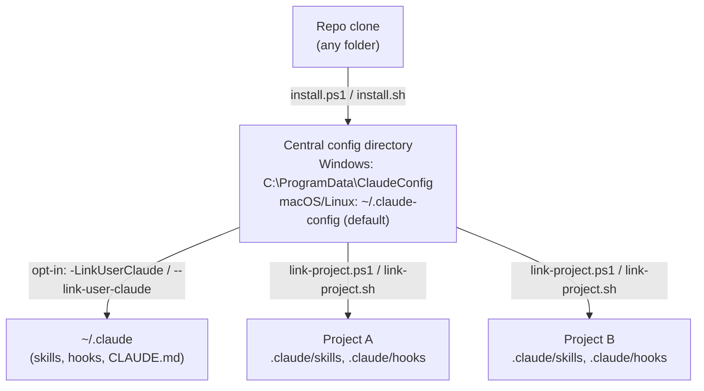

# Installation guide

This repository can be cloned into any folder. The scripts at the repo root turn that clone into a **central, machine-wide SDD configuration** that Claude Code reads from — and, optionally, link that central configuration into your per-user Claude Code home and into individual projects.

Three concerns, three scripts:

| Concern | Script | What it touches |
|---|---|---|
| Install repo content into a central config directory | `install.ps1` (Windows) / `install.sh` (macOS/Linux) | The central directory only, by default |
| Link your per-user Claude Code home to that central directory | same scripts, `-LinkUserClaude` / `--link-user-claude` | `~/.claude` — opt-in, off by default |
| Link one specific project to the central directory | `link-project.ps1` / `link-project.sh` | `<project>/.claude` only |

All three scripts are **idempotent** and **safe to re-run**: an already-correct install or link is detected and reported as a no-op, nothing is deleted, and any overwrite requires `-Force`/`--force` and is preceded by an automatic timestamped backup.

---

## Architecture



The central directory is the single source of truth. Everything else — your user-level `~/.claude`, and any individual project — is a link pointing at it, never a copy. Update the central directory once (`git pull` in the clone, then re-run `install.ps1`/`install.sh`), and every linked location picks up the change immediately.

**One exception: agents.** Agent definitions (`agents/*.md`, used by the multi-model orchestrated workflow — see [SDD-ORCHESTRATION.md](SDD-ORCHESTRATION.md)) are **copied file-by-file, never linked**, into `~/.claude/agents/` (by `-LinkUserClaude`/`--link-user-claude`) and `<project>/.claude/agents/` (by `link-project`). Those directories commonly contain user- or project-authored agents that a directory link would hide. Copies are additive: existing files are never touched, same-name files that differ are skipped without `-Force`/`--force` (with force, a timestamped backup is taken first). Consequence: after `git pull`, re-run the installer (and `link-project` where used) to refresh agents — they do not update through a link like skills/hooks do.

---

## Profile-aware installation

Both scripts read [`profiles.json`](../profiles.json) to decide **which** skills, hooks, templates, and agents to install. Every profile declares SHIPPED entries (`skills`/`hooks`/`templates`/`agents` — must exist on disk) and PLANNED entries (`plannedSkills`/`plannedHooks`/`plannedTemplates`/`plannedAgents` — roadmap-only, may not exist yet). The `agents`/`plannedAgents` keys are optional per profile (added in 0.4.0; only `core` ships agents today). See [Profiles](../README.md#profiles) in the main README for the full explanation.

```bash
# Install default: core + java-spring-backend (the default profile in profiles.json)
./install.sh
.\install.ps1                                          # Windows equivalent

# Install an explicit profile (still adds core automatically)
./install.sh --profile java-spring-backend
.\install.ps1 -Profile java-spring-backend              # Windows equivalent

# Install multiple profiles at once (comma-separated, or repeat the flag)
./install.sh --profile java-spring-backend,messaging-event-driven
./install.sh --profile java-spring-backend --profile messaging-event-driven
.\install.ps1 -Profile java-spring-backend,messaging-event-driven   # Windows equivalent
```

**What you'll see for planned items** — `messaging-event-driven` now ships 2 review skills
(`event-driven-reviewer`, `microservices-patterns-reviewer`) and 2 templates (`MESSAGING.md`,
`MICROSERVICES_PATTERNS.md`) as of Phase 3; only its hook (`messaging-review-reminder`) is still a
planned item. Installing the profile installs the shipped skills/templates and prints one line for
the still-planned hook:

```
[planned] hook 'messaging-review-reminder'  - not installed (planned for a future phase)
```

This is expected and not an error — planned items are declared for roadmap visibility, not for
installation. Note that `--profile messaging-event-driven` on its own does **not** also install
`java-spring-backend` — pass both explicitly (as shown above) if you want both.

**What never happens** — the installer never falls back to "install everything" or "no filtering." These all abort with a clear `[ERROR]` and a non-zero exit code, before any files are written (or, for the last case, alongside the rest of the dry-run preview):

- An unknown `--profile`/`-Profile` name (typo protection).
- An explicit request for the disabled `blockchain-crypto` profile.
- A SHIPPED item (declared under `skills`/`hooks`/`templates`, not the `planned*` arrays) that doesn't actually exist on disk — this means `profiles.json` has drifted from the repo, which is a manifest integrity bug, not a planned gap.
- `profiles.json` itself missing or not valid JSON.

**macOS/Linux requires `python3`** to resolve `profiles.json` (standard library `json` module only — no `jq`, no dependency installs). If `python3` isn't available or doesn't actually run (some systems ship a non-functional `python3` shim), `install.sh` fails with:

```
[ERROR]   python3 is required to resolve profiles.json on macOS/Linux. Install Python 3 or use the Windows installer.
```

`install.ps1` uses PowerShell's built-in `ConvertFrom-Json` and has no external dependency for profile resolution.

---

## Windows

### Install

The intended central location on Windows is **`C:\ProgramData\ClaudeConfig`** — a machine-wide directory (not tied to one user profile), matching how this workflow was originally set up.

```powershell
git clone https://github.com/manujc00005/spec-driven-development.git
cd spec-driven-development

# Preview first — writes nothing
.\install.ps1 -DryRun

# Install into C:\ProgramData\ClaudeConfig
.\install.ps1
```

`C:\ProgramData` is writable by the local Administrators group by default on most Windows installs. If `install.ps1` fails to create the directory, run PowerShell as Administrator, or pass a different `-CentralDir` you do have write access to.

### Link your per-user Claude Code home (optional)

This step makes Claude Code, running as your Windows user, actually pick up the skills/hooks from the central directory — by creating **Junctions** (directories) and a **Symbolic Link** (the `CLAUDE.md` file) under `%USERPROFILE%\.claude`. It's opt-in because it modifies your personal Claude Code configuration, not just the central directory:

```powershell
.\install.ps1 -LinkUserClaude
```

- Agent files (`agents/*.md`) are **copied** into `%USERPROFILE%\.claude\agents\` in this same step — per-file and additive, never a junction (see the agents exception under [Architecture](#architecture)).
- Junctions do not require Administrator rights on Windows.
- The `CLAUDE.md` file link **does** require Administrator rights or Developer Mode enabled (`Settings → Privacy & Security → For developers → Developer Mode`). If it fails, the script reports it and continues — everything else still gets installed/linked.
- If `~/.claude/skills` or `~/.claude/hooks` already exist as real directories with real content, the script backs them up to `skills.bak-<timestamp>` / `hooks.bak-<timestamp>` before replacing them — and only does so with `-Force`.
- If they're already linked to the right place, this is a no-op.

### Link an individual project

```powershell
cd C:\code\my-project
C:\path\to\spec-driven-development\link-project.ps1
```

This creates `my-project\.claude\skills` and `my-project\.claude\hooks` as Junctions to the central directory, and copies the shipped agent files into `my-project\.claude\agents\` (per-file, additive), without touching `my-project\.claude\settings.local.json` or anything else already in `.claude\`.

---

## macOS

> **If you meant "iOS" — see [iOS](#ios) below; this section is for macOS.**

There's no exact macOS equivalent of `C:\ProgramData` (a writable, machine-wide directory outside any user's home, without requiring `sudo`). The script defaults to a **user-level** central directory instead, so no elevated privileges are needed:

```bash
git clone https://github.com/manujc00005/spec-driven-development.git
cd spec-driven-development

# Preview first — writes nothing
./install.sh --dry-run

# Install into ~/.claude-config (default)
./install.sh
```

If you specifically want a machine-wide, multi-user location analogous to `ProgramData` (shared across every user account on the Mac), use:

```bash
sudo ./install.sh --central-dir /usr/local/etc/claude-config
```

This requires `sudo` because `/usr/local/etc` is typically owned by `root`/`admin`. Only do this if multiple macOS user accounts on the same machine need to share one SDD configuration; for a single-user setup, the default `~/.claude-config` is simpler and doesn't need `sudo` anywhere in the flow, including the linking step below.

### Link your per-user Claude Code home (optional)

```bash
./install.sh --link-user-claude
```

Same behavior as Windows conceptually: creates symlinks (macOS/Linux don't distinguish "junction" from "symlink" the way Windows does) for `~/.claude/skills`, `~/.claude/hooks`, and `~/.claude/CLAUDE.md`, and **copies** the shipped agent files into `~/.claude/agents/` (per-file, additive — never a symlinked directory). Existing real directories are backed up to `<path>.bak-<timestamp>` before being replaced, and only with `--force`.

### Link an individual project

```bash
cd ~/code/my-project
/path/to/spec-driven-development/link-project.sh
```

---

## iOS

Claude Code is a terminal/CLI tool that requires a local shell (PowerShell, bash/zsh), a writable filesystem outside an app sandbox, and the ability to spawn subprocesses (git, npx, mvnw, etc.). iOS does not provide any of that to installed apps — there is no supported way to run Claude Code, this installer, or the hook scripts natively on iOS.

**If "iOS" in your request meant macOS, use the [macOS](#macos) section above** — that's the assumption this guide makes. If you specifically need iOS support, it isn't realistic for a local Claude Code installation; the closest options are running Claude Code on a remote machine (a Mac, a Linux VM, or a cloud dev environment) and accessing it from iOS over SSH or a remote-desktop-style client — which is a remote-access setup, not an iOS-native install of this repo.

---

## Wiring hooks into a project

Installing/linking makes the hook *scripts* available; Claude Code only runs them once they are wired in the project's `.claude/settings.json`. Two ready-to-copy templates ship at the repo root, wiring the same hook set:

- **Windows:** [`settings.template.json`](../settings.template.json) — PowerShell commands (`powershell -NoProfile -File ...hooks/<name>.ps1`).
- **macOS/Linux:** [`settings.template.sh.json`](../settings.template.sh.json) — bash commands (`bash ...hooks/<name>.sh`; run `chmod +x hooks/*.sh hooks/lib/claude-json.sh` once if needed).

Per-hook detail (what each one does, which are opt-in, which are deprecated) is in [`hooks/README.md`](../hooks/README.md).

---

## Safety model (applies to all three scripts)

- **Idempotent** — running any script twice with nothing changed produces no changes the second time; already-correct state is reported and skipped.
- **Additive by default** — missing files/links are created; existing files that already match are left alone; existing files that differ are reported and skipped **unless** `-Force`/`--force` is passed.
- **Backup before overwrite** — any time a script is about to overwrite a file or replace a real directory with a link, it copies the existing content to a timestamped backup first (`_install-backups/<timestamp>/...` for file content, `<path>.bak-<timestamp>` for whole directories). Nothing is overwritten without a recoverable copy existing first.
- **Never touches `settings.local.json`** — excluded by an explicit pattern check in every copy path, in addition to this repo never containing one in the first place.
- **Never writes `CLAUDE.md` or `settings.json` directly** — only `CLAUDE.md.example` and `settings.template.json` are ever installed under those exact names, so an existing real `CLAUDE.md`/`settings.json` at your central directory is never silently replaced by the generic example.
- **User-level linking is opt-in** — installing content into the central directory never touches `~/.claude` unless you explicitly pass `-LinkUserClaude` / `--link-user-claude`.
- **`-DryRun` / `--dry-run`** — every script supports a full preview mode. Use it before the first real run on a machine you care about.
- **Profile resolution never guesses** — an unknown profile name, a disabled profile requested explicitly, a missing shipped item, or an unparsable `profiles.json` all abort with a clear `[ERROR]` and a non-zero exit code rather than silently installing everything or skipping the filter. See [Profile-aware installation](#profile-aware-installation) above.

---

## Verifying an existing install

**Windows** — check whether a path is a Junction/SymbolicLink and where it points:

```powershell
Get-Item "$env:USERPROFILE\.claude\skills" -Force | Select-Object LinkType, Target
```

**macOS/Linux** — check whether a path is a symlink and where it points:

```bash
readlink "$HOME/.claude/skills"
```

**Agents (both platforms)** — agents are plain copied files, not links; just check they exist:

```powershell
Get-ChildItem "$env:USERPROFILE\.claude\agents\deep-reasoner.md", "$env:USERPROFILE\.claude\agents\fast-worker.md"
```

```bash
ls "$HOME/.claude/agents/deep-reasoner.md" "$HOME/.claude/agents/fast-worker.md"
```

---

## Uninstalling / rolling back

- **Remove a link** (Windows): `Remove-Item "$env:USERPROFILE\.claude\skills" -Force` (only removes the link itself, never the central directory's actual content).
- **Remove a link** (macOS/Linux): `rm "$HOME/.claude/skills"`.
- **Restore from a backup**: if a script backed up a real directory to `<path>.bak-<timestamp>`, remove the link at `<path>` and rename the backup back to `<path>`.
- **Restore an overwritten file**: copy it back from `<central-dir>/_install-backups/<timestamp>/...`.
- **Remove the copied agents**: delete `deep-reasoner.md` / `fast-worker.md` from `~/.claude/agents/` or `<project>/.claude/agents/` — they are plain files; deleting them affects nothing else (see [SDD-ORCHESTRATION.md](SDD-ORCHESTRATION.md) for the full orchestration rollback).

Nothing in this repo automatically deletes a `.bak-*` directory or an `_install-backups` snapshot — cleanup, if wanted, is a manual, explicit step.

---

## Graphify (optional)

This workflow includes **Graphify-aware skills** (`/context-manager`, `/graphify-context`, `/sdd-onboard`) and a **`graphify-stale-reminder`** hook. These are designed to use a `GRAPH_REPORT.md` file (an architecture/dependency map) to speed up impact analysis and reduce token waste on large codebases.

**Graphify is not installed by this repo.** It is an external tool that the user runs independently to produce `GRAPH_REPORT.md` in a project's root.

**What happens without Graphify:**

- All Graphify-aware skills **work without it** — they detect the absence of `GRAPH_REPORT.md` and fall back to heuristic scanning or bounded file reads.
- The `graphify-stale-reminder` hook prints a one-line suggestion if the file is missing; it never blocks.
- No skill, hook, or workflow step **requires** Graphify to function.

**To take advantage of Graphify:**

1. Install and run Graphify externally against your project (follow Graphify's own documentation).
2. Ensure it outputs `GRAPH_REPORT.md` at your project root.
3. The skills and hook will automatically detect it and use it for impact analysis.
4. Re-run Graphify periodically — the hook warns if the map is >7 days stale relative to source changes.
