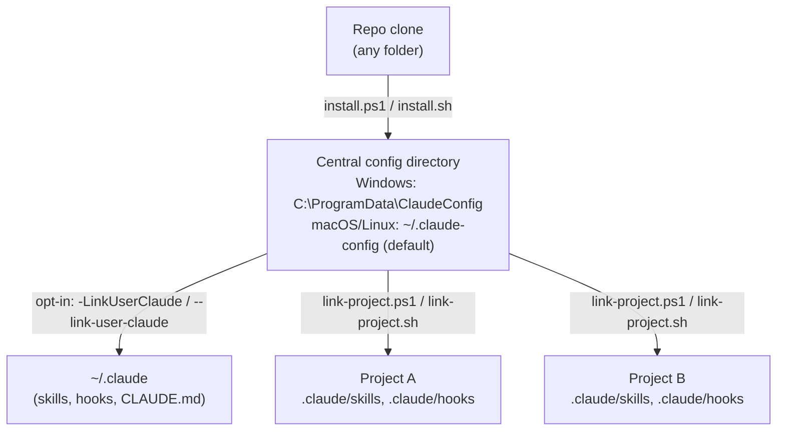

# Installation guide

There are two ways to get the framework onto a machine.

1. **As a plugin** — the repository root is the `sdd` plugin and its own marketplace; two commands per host, nothing copied or linked. This is the primary path: [Install as a plugin](#install-as-a-plugin).
2. **With the scripts** — the alternative for a subset of profiles, for Windows hooks, and for a per-project Codex `AGENTS.md`. The scripts turn a clone into a **central, machine-wide SDD configuration** that Claude Code reads from and, optionally, link it into your per-user Claude Code home and into individual projects.

Pick one per machine (see the caveats in the plugin section). Four concerns, four scripts:

| Concern | Script | What it touches |
|---|---|---|
| Install repo content into a central config directory | `install.ps1` (Windows) / `install.sh` (macOS/Linux) | The central directory only, by default |
| Link your per-user Claude Code home to that central directory | same scripts, `-LinkUserClaude` / `--link-user-claude` | `~/.claude` — opt-in, off by default |
| Link one specific project to the central directory | `link-project.ps1` / `link-project.sh` | `<project>/.claude` only |
| Wire the shipped hooks into a project's settings | `scripts/wire-hooks.ps1` / `scripts/wire-hooks.sh` | `<project>/.claude/settings.json` only — explicit opt-in |

All scripts are **idempotent** and **safe to re-run**: an already-correct install or link is detected and reported as a no-op, nothing is deleted, and any overwrite requires `-Force`/`--force` and is preceded by an automatic timestamped backup.

> **Scope of this guide.** The four scripts above install the **Claude Code adapter** — the primary, shipped adapter. SDD is a provider-neutral workflow with per-provider packaging; the Codex adapter and the "install both" wrapper are covered in [Provider adapters](#provider-adapters) below. Everything from [Wiring hooks](#wiring-hooks-into-a-project) onward describes the Claude adapter.

---

## Install as a plugin

The repository root is a Claude Code plugin named `sdd`, and the repository is its own marketplace
(spec 044). This is the shortest path and the one that needs no installer of ours:

```bash
# Claude Code — from a clone, or replace the path with the GitHub repo (owner/name)
claude plugin marketplace add /path/to/spec-driven-development
claude plugin install sdd@spec-driven-development
```

```bash
# Codex
codex plugin marketplace add /path/to/spec-driven-development
codex plugin add sdd@spec-driven-development
```

That installs the 72 skills, the 8 agents and the default hook set from `hooks/hooks.json`, wired
through `${CLAUDE_PLUGIN_ROOT}` — nothing is copied into your project. `claude plugin details sdd`
shows the inventory and the projected token cost.

Two things to know before you choose this path:

- **Windows hooks stay on the installer for now.** `hooks/hooks.json` runs the `.sh` hooks with
  `bash`; the PowerShell variants are not wired by the plugin. On Windows, use the installer below and
  `settings.template.json` until a later spec verifies plugin hooks there.
- **Do not wire the same hooks twice.** If a project already has the hooks in its
  `.claude/settings.json` (from `scripts/wire-hooks.sh`), enabling the plugin makes every hook fire
  twice per event. Pick one: remove the project wiring, or do not enable the plugin for that project.
- **Do not ship the same skills twice either.** If you installed with `--link-user-claude`,
  `~/.claude/skills` already points at the central copy; enabling the plugin as well lists every skill
  twice (`verifier` and `sdd:verifier`). Pick one path per machine: the plugin, or the installer link.
- **A local-directory marketplace loads in place.** When the marketplace was added from a checkout
  path, the plugin root *is* that checkout: whatever that working tree holds runs in every project
  with the plugin enabled at the next session — half-finished edits, and also any branch you check
  out there, a contributor's PR branch included. If you review other people's branches in that
  clone, point the marketplace at a separate clone you only fast-forward, or at the GitHub source,
  which goes through the plugin cache and does not have this property.
- **What you are trusting.** The hooks are bash scripts that run with your user's privileges on
  nearly every tool call in an enabled project. Four of them run project-controlled code from the
  project's own tree — `npx eslint --fix`, `npx prettier`, `npx tsc`, and `./mvnw` or `./gradlew`.
  That was already true when a project wired them by hand; the plugin at **user** scope extends it
  to every repository you open, including a freshly cloned one you have not read yet. For untrusted
  checkouts, install with `--scope project` and enable the plugin only where you want it. Updates
  from the GitHub source arrive with whatever the default branch holds; read the diff before
  `claude plugin marketplace update` if that matters to you.

The installer below keeps working unchanged and remains the path for profiles, Windows, and
per-project Codex targets.

## Provider adapters

SDD Core (the SPEC/PLAN/TASKS/DECISIONS lifecycle, review gates, skill contracts, agent responsibility model, and guardrail intent) is **provider-neutral**. A **provider adapter** packages that core for a specific AI coding agent. Full model and rationale: [`PROVIDER_ADAPTERS.md`](PROVIDER_ADAPTERS.md); registry and capability matrix: [`../adapters/README.md`](../adapters/README.md).

| Adapter | Status | Installer | Installs to |
|---|---|---|---|
| **Claude Code** | Primary, shipped. *It is the repository root* — no files were moved. | `install.sh` / `install.ps1` (+ the three scripts above) | Central config dir (+ opt-in `~/.claude`) |
| **Codex** | Prompt-based; the plugin path into Codex is verified (spec 044), the lifecycle prompts are not. No parity claimed. | `adapters/codex/install-codex.sh` / `.ps1` (copy-only) | Project-root `AGENTS.md` + `~/.codex/prompts/` |

The two adapters install to **disjoint locations and never overlap**, and each installer is independently idempotent.

### The Codex adapter on its own

Copy-only: it never runs the `codex` CLI, never touches secrets or your existing `~/.codex/config.toml`, and backs up any file it would overwrite. Preview first:

```bash
# from the repo root
./adapters/codex/install-codex.sh --dry-run --target /path/to/your/project     # writes nothing
./adapters/codex/install-codex.sh --target /path/to/your/project               # AGENTS.md + prompts
```

```powershell
.\adapters\codex\install-codex.ps1 -Target C:\code\my-app                       # Windows twin
```

Flags: `--target DIR` (project root that receives `AGENTS.md` — **required to install `AGENTS.md`**; without it, `AGENTS.md` is skipped and only the prompts install; the framework repo root is refused), `--codex-home DIR` (prompts go to `<codex-home>/prompts`, default `~/.codex`), `--prompts-only` / `--agents-only`, `--dry-run`, `--force`. Its guardrails are **conventions, not enforced hooks** — see [`../adapters/codex/PARITY.md`](../adapters/codex/PARITY.md) for the full list of what does and does not carry over from the Claude adapter.

### Installing both — `install-all`

A thin convenience wrapper installs both adapters by **calling** the two installers in order (Claude first, then Codex). It does **not** modify or reimplement either installer, so each stays the single source of truth for its own behavior and safety guarantees:

```bash
./install-all.sh --dry-run                             # preview both; writes nothing
./install-all.sh --codex-target /path/to/your/project  # Claude, then Codex
./install-all.sh --skip-codex                          # only Claude   ·   --skip-claude → only Codex
```

```powershell
.\install-all.ps1 -CodexTarget C:\code\my-app          # Windows twin
```

- `--dry-run` / `--force` are forwarded to **both** installers.
- `--profile` / `--link-user-claude` go to the Claude installer; `--codex-target` / `--codex-home` go to the Codex installer. `--claude-args "…"` / `--codex-args "…"` pass extra raw flags through to each.
- **`--codex-target` is what installs `AGENTS.md`.** Without it, `install-all` still installs the Codex **prompts** globally but skips the per-project `AGENTS.md` (it is never dropped into the current directory or the framework repo). Pass `--codex-target <your-project>` to install `AGENTS.md` too.
- If the Claude step fails, the wrapper **skips Codex** and returns that exit code — no partial-state surprise.
- Because each installer is idempotent, re-running adds only what is missing for that adapter. There is no "detect and install the rest" — you choose which adapters to run.

---

## Wiring hooks into a project

Linking a project (`link-project`) makes the hook **scripts** available at `<project>/.claude/hooks/`, but Claude Code only executes hooks that are registered in the project's `.claude/settings.json`. That registration is deliberately not part of the installers (they never write `settings.json` or `CLAUDE.md`); it is its own explicit step:

```bash
# macOS/Linux — merges the "hooks" key from settings.template.sh.json
/path/to/spec-driven-development/scripts/wire-hooks.sh --project-dir /path/to/my-project
```

```powershell
# Windows — merges from settings.template.json
C:\path\to\spec-driven-development\scripts\wire-hooks.ps1 -ProjectDir C:\path\to\my-project
```

The merge is **additive and idempotent**: existing keys and hand-added hooks are preserved, shipped entries are deduplicated by command string, a timestamped backup of `settings.json` is taken before any write, and `settings.local.json` is never touched. `--dry-run` / `-DryRun` previews the result. Without this step (or a manual merge from the settings templates), hooks like `project-init-check` and `git-guardrails` never run.

---

## Architecture


```mermaid
flowchart TD
    R["Repo clone\n(any folder)"] -->|install.ps1 / install.sh| C["Central config directory\nWindows: C:\ProgramData\ClaudeConfig\nmacOS/Linux: ~/.claude-config (default)"]
    C -->|opt-in: -LinkUserClaude / --link-user-claude| U["~/.claude\n(skills, hooks, CLAUDE.md)"]
    C -->|link-project.ps1 / link-project.sh| P1["Project A\n.claude/skills, .claude/hooks"]
    C -->|link-project.ps1 / link-project.sh| P2["Project B\n.claude/skills, .claude/hooks"]
```

The central directory is the single source of truth. Everything else — your user-level `~/.claude`, and any individual project — is a link pointing at it, never a copy. Update the central directory once (see [Updating an existing install](#updating-an-existing-install)), and every linked location picks up the change immediately.

**One exception: agents.** Agent definitions (`agents/*.md`, used by the multi-model orchestrated workflow — see [SDD-ORCHESTRATION.md](SDD-ORCHESTRATION.md)) are **copied file-by-file, never linked**, into `~/.claude/agents/` (by `-LinkUserClaude`/`--link-user-claude`) and `<project>/.claude/agents/` (by `link-project`). Those directories commonly contain user- or project-authored agents that a directory link would hide. Copies are additive: existing files are never touched, same-name files that differ are skipped without `-Force`/`--force` (with force, a timestamped backup is taken first). Consequence: agents do not update through a link like skills/hooks do — `update.sh`/`update.ps1` re-copies them for `~/.claude` and for each `--project-dir` you pass.

---

## Profile-aware installation

Both scripts read [`profiles.json`](../profiles.json) to decide **which** skills, hooks, templates, and agents to install. Every profile declares SHIPPED entries (`skills`/`hooks`/`templates`/`agents` — must exist on disk) and PLANNED entries (`plannedSkills`/`plannedHooks`/`plannedTemplates`/`plannedAgents` — roadmap-only, may not exist yet). The `agents`/`plannedAgents` keys are optional per profile (added in 0.4.0; only `core` ships agents today). See [Profiles](../README.md#️-profiles) in the main README for the full explanation.

```bash
# Install default: core + java-spring-backend (the default profile in profiles.json)
./install.sh
.\install.ps1                                          # Windows equivalent

# Install an explicit profile (still adds core automatically)
./install.sh --profile java-spring-backend
.\install.ps1 -Profile java-spring-backend              # Windows equivalent

# Install multiple profiles at once (comma-separated, or repeat the flag)
./install.sh --profile java-spring-backend,messaging-event-driven
./install.sh --profile java-spring-backend --profile messaging-event-driven
.\install.ps1 -Profile java-spring-backend,messaging-event-driven   # Windows equivalent
```

### A repository with more than one stack

A repository that is genuinely Java **and** Python does not have to pick a winner. Install both
profiles; they accumulate, and the installer never deletes:

```bash
./install.sh --profile java-spring-backend,python-sql-data
.\install.ps1 -Profile java-spring-backend,python-sql-data          # Windows equivalent
```

Reviews then select reviewers **by the files a diff changes**, not by a profile: the Java reviewers
run on the `.java` files and the Python/SQL reviewers on the `.py` and `.sql` files, in the same
pass. Nothing asks you which profile applies, because at review time that question no longer
exists — a profile is a **packaging** decision that controls what lands on disk at install time and
stops there. Installing every profile is a supported configuration, not a misuse; it simply makes
the profile concept irrelevant to your reviews, which is the point.

### `--all-profiles` — everything enabled, in one request

```bash
./install.sh --all-profiles
.\install.ps1 -AllProfiles                                          # Windows equivalent
```

"Enabled" means simply **not marked `disabled`** in `profiles.json`. Two things a blanket request
never installs, and it names both rather than dropping them silently:

- **Disabled profiles** (`blockchain-crypto` today). Naming one with `--profile` still fails hard,
  exactly as before — the blanket flag does not soften that.
- **Billable add-ons** (`"billable": true` — `seo-geo-addon` today). These are separately-billed
  services, so a blanket request must not switch one on. Install it explicitly when the client has
  contracted it: `./install.sh --profile seo-geo-addon`, or combine the two —
  `./install.sh --all-profiles --profile seo-geo-addon` installs the union.

You will see the exclusions in the output:

```
[install] Active profiles: core java-spring-backend messaging-event-driven payments-fintech next-prisma-web delivery-operations python-sql-data
[install] Skipped (billable add-on, not installed by --all-profiles): seo-geo-addon
[install] Skipped (disabled in profiles.json): blockchain-crypto
```

One consequence worth knowing: a profile added to `profiles.json` later is picked up by
`--all-profiles` by default, because silence means enabled. If you want a fixed set, name the
profiles explicitly instead.

### What `update.sh` does — and does not — do afterwards

`scripts/update.sh` re-installs exactly the profiles recorded in
`<central-dir>/.sdd-install.json`. It **never adds a profile you did not ask for**. So a profile
added to the framework after your last `install.sh` run does not arrive on an update — it is
reported instead, with the command that would add it:

```
[warn]   Profiles available but NOT installed here (this update did not add them):
    python-sql-data  ->  ./install.sh --profile python-sql-data
    seo-geo-addon  (billable add-on)  ->  ./install.sh --profile seo-geo-addon
```

Adding one is your decision and takes one command. If the manifest is missing or unreadable, the
update says it **cannot compare** rather than listing every profile as new — an empty manifest is
not the same as an empty install.

**What you'll see for planned items** — `messaging-event-driven` now ships 2 review skills
(`event-driven-reviewer`, `microservices-patterns-reviewer`) and 2 templates (`MESSAGING.md`,
`MICROSERVICES_PATTERNS.md`) as of Phase 3; only its hook (`messaging-review-reminder`) is still a
planned item. Installing the profile installs the shipped skills/templates and prints one line for
the still-planned hook:

```
[planned] hook 'messaging-review-reminder'  - not installed (planned for a future phase)
```

This is expected and not an error — planned items are declared for roadmap visibility, not for
installation. Note that `--profile messaging-event-driven` on its own does **not** also install
`java-spring-backend` — pass both explicitly (as shown above) if you want both.

**What never happens** — the installer never falls back to "install everything" or "no filtering." These all abort with a clear `[ERROR]` and a non-zero exit code, before any files are written (or, for the last case, alongside the rest of the dry-run preview):

- An unknown `--profile`/`-Profile` name (typo protection).
- An explicit request for the disabled `blockchain-crypto` profile.
- A SHIPPED item (declared under `skills`/`hooks`/`templates`, not the `planned*` arrays) that doesn't actually exist on disk — this means `profiles.json` has drifted from the repo, which is a manifest integrity bug, not a planned gap.
- `profiles.json` itself missing or not valid JSON.

**macOS/Linux requires `python3`** to resolve `profiles.json` (standard library `json` module only — no `jq`, no dependency installs). If `python3` isn't available or doesn't actually run (some systems ship a non-functional `python3` shim), `install.sh` fails with:

```
[ERROR]   python3 is required to resolve profiles.json on macOS/Linux. Install Python 3 or use the Windows installer.
```

`install.ps1` uses PowerShell's built-in `ConvertFrom-Json` and has no external dependency for profile resolution.

**Works with macOS's stock bash 3.2.** macOS still ships bash 3.2 (2007) as `/bin/bash` for licensing reasons. `install.sh`, `link-project.sh`, and every `.sh` hook deliberately avoid bash-4-only features (no associative arrays, no `mapfile`, no `${var,,}`), and empty-array expansions are guarded for bash 3.2's `set -u` behavior — no Homebrew bash required.

---

## Windows

### Install

The intended central location on Windows is **`C:\ProgramData\ClaudeConfig`** — a machine-wide directory (not tied to one user profile), matching how this workflow was originally set up.

```powershell
git clone https://github.com/manujc00005/spec-driven-development.git
cd spec-driven-development

# Preview first — writes nothing
.\install.ps1 -DryRun

# Install into C:\ProgramData\ClaudeConfig
.\install.ps1
```

`C:\ProgramData` is writable by the local Administrators group by default on most Windows installs. If `install.ps1` fails to create the directory, run PowerShell as Administrator, or pass a different `-CentralDir` you do have write access to.

### Link your per-user Claude Code home (optional)

This step makes Claude Code, running as your Windows user, actually pick up the skills/hooks from the central directory — by creating **Junctions** (directories) and a **Symbolic Link** (the `CLAUDE.md` file) under `%USERPROFILE%\.claude`. It's opt-in because it modifies your personal Claude Code configuration, not just the central directory:

```powershell
.\install.ps1 -LinkUserClaude
```

- Agent files (`agents/*.md`) are **copied** into `%USERPROFILE%\.claude\agents\` in this same step — per-file and additive, never a junction (see the agents exception under [Architecture](#architecture)).
- Junctions do not require Administrator rights on Windows.
- A **symbolic link** for `CLAUDE.md` does require Administrator rights or Developer Mode enabled (`Settings → Privacy & Security → For developers → Developer Mode`). Without either, the installer steps down instead of giving up (spec 039), warning at each downgrade:
  1. **Symbolic link** — the intended result: one file, two names, always in step.
  2. **Hard link** — no privilege needed, but both paths must be on the **same volume**, and it is *not* a symlink: if the central `CLAUDE.md` is ever replaced by rename (the usual atomic-write pattern) the two names stop being the same file and drift apart with no error.
  3. **Copy** — a last-resort snapshot. It is **not kept in sync**: after editing the central `CLAUDE.md`, delete `%USERPROFILE%\.claude\CLAUDE.md` and re-run the installer.
- The `CLAUDE.md` link is attempted **after** the personal layer is restored, because that import is what creates `<central-dir>\CLAUDE.md` on a first install (spec 039). The repo itself only ships `CLAUDE.md.example`.
- If `~/.claude/skills` or `~/.claude/hooks` already exist as real directories with real content, the script backs them up to `skills.bak-<timestamp>` / `hooks.bak-<timestamp>` before replacing them — and only does so with `-Force`.
- If they're already linked to the right place, this is a no-op.

### Link an individual project

```powershell
cd C:\code\my-project
C:\path\to\spec-driven-development\link-project.ps1
```

This creates `my-project\.claude\skills` and `my-project\.claude\hooks` as Junctions to the central directory, and copies the shipped agent files into `my-project\.claude\agents\` (per-file, additive), without touching `my-project\.claude\settings.local.json` or anything else already in `.claude\`.

---

## macOS

> **If you meant "iOS" — see [iOS](#ios) below; this section is for macOS.**

There's no exact macOS equivalent of `C:\ProgramData` (a writable, machine-wide directory outside any user's home, without requiring `sudo`). The script defaults to a **user-level** central directory instead, so no elevated privileges are needed:

```bash
git clone https://github.com/manujc00005/spec-driven-development.git
cd spec-driven-development

# Preview first — writes nothing
./install.sh --dry-run

# Install into ~/.claude-config (default)
./install.sh
```

If you specifically want a machine-wide, multi-user location analogous to `ProgramData` (shared across every user account on the Mac), use:

```bash
sudo ./install.sh --central-dir /usr/local/etc/claude-config
```

This requires `sudo` because `/usr/local/etc` is typically owned by `root`/`admin`. Only do this if multiple macOS user accounts on the same machine need to share one SDD configuration; for a single-user setup, the default `~/.claude-config` is simpler and doesn't need `sudo` anywhere in the flow, including the linking step below.

### Link your per-user Claude Code home (optional)

```bash
./install.sh --link-user-claude
```

Same behavior as Windows conceptually: creates symlinks (macOS/Linux don't distinguish "junction" from "symlink" the way Windows does) for `~/.claude/skills`, `~/.claude/hooks`, and `~/.claude/CLAUDE.md`, and **copies** the shipped agent files into `~/.claude/agents/` (per-file, additive — never a symlinked directory). Existing real directories are backed up to `<path>.bak-<timestamp>` before being replaced, and only with `--force`.

### Link an individual project

```bash
cd ~/code/my-project
/path/to/spec-driven-development/link-project.sh
```

---

## iOS

Claude Code is a terminal/CLI tool that requires a local shell (PowerShell, bash/zsh), a writable filesystem outside an app sandbox, and the ability to spawn subprocesses (git, npx, mvnw, etc.). iOS does not provide any of that to installed apps — there is no supported way to run Claude Code, this installer, or the hook scripts natively on iOS.

**If "iOS" in your request meant macOS, use the [macOS](#macos) section above** — that's the assumption this guide makes. If you specifically need iOS support, it isn't realistic for a local Claude Code installation; the closest options are running Claude Code on a remote machine (a Mac, a Linux VM, or a cloud dev environment) and accessing it from iOS over SSH or a remote-desktop-style client — which is a remote-access setup, not an iOS-native install of this repo.

---

## Hook wiring templates

Installing/linking makes the hook *scripts* available; Claude Code only runs them once they are wired. With the **plugin**, that wiring is `hooks/hooks.json` and happens for every enabled project. With the **scripts**, it is the project's `.claude/settings.json`, and two ready-to-copy templates ship at the repo root, wiring the same hook set:

- **Windows:** [`settings.template.json`](../settings.template.json) — PowerShell commands (`powershell -NoProfile -File ...hooks/<name>.ps1`).
- **macOS/Linux:** [`settings.template.sh.json`](../settings.template.sh.json) — bash commands (`bash ...hooks/<name>.sh`; run `chmod +x hooks/*.sh hooks/lib/claude-json.sh` once if needed).

Per-hook detail (what each one does, which are opt-in, which are deprecated) is in [`hooks/README.md`](../hooks/README.md).

---

## Safety model (applies to every script above)

- **Idempotent** — running any script twice with nothing changed produces no changes the second time; already-correct state is reported and skipped.
- **Additive by default** — missing files/links are created; existing files that already match are left alone; existing files that differ are reported and skipped **unless** `-Force`/`--force` is passed.
- **Backup before overwrite** — any time a script is about to overwrite a file or replace a real directory with a link, it copies the existing content to a timestamped backup first (`_install-backups/<timestamp>/...` for file content, `<path>.bak-<timestamp>` for whole directories). Nothing is overwritten without a recoverable copy existing first.
- **Never touches `settings.local.json`** — excluded by an explicit pattern check in every copy path, in addition to this repo never containing one in the first place.
- **Never writes `CLAUDE.md` or `settings.json` directly** — only `CLAUDE.md.example` and `settings.template.json` are ever installed under those exact names, so an existing real `CLAUDE.md`/`settings.json` at your central directory is never silently replaced by the generic example.
- **User-level linking is opt-in** — installing content into the central directory never touches `~/.claude` unless you explicitly pass `-LinkUserClaude` / `--link-user-claude`.
- **`-DryRun` / `--dry-run`** — every script supports a full preview mode. Use it before the first real run on a machine you care about.
- **Profile resolution never guesses** — an unknown profile name, a disabled profile requested explicitly, a missing shipped item, or an unparsable `profiles.json` all abort with a clear `[ERROR]` and a non-zero exit code rather than silently installing everything or skipping the filter. See [Profile-aware installation](#profile-aware-installation) above.

---

## Verifying an existing install

**Windows** — check whether a path is a Junction/SymbolicLink and where it points:

```powershell
Get-Item "$env:USERPROFILE\.claude\skills" -Force | Select-Object LinkType, Target
```

**macOS/Linux** — check whether a path is a symlink and where it points:

```bash
readlink "$HOME/.claude/skills"
```

**Agents (both platforms)** — agents are plain copied files, not links; just check they exist:

```powershell
Get-ChildItem "$env:USERPROFILE\.claude\agents\deep-reasoner.md", "$env:USERPROFILE\.claude\agents\fast-worker.md"
```

```bash
ls "$HOME/.claude/agents/deep-reasoner.md" "$HOME/.claude/agents/fast-worker.md"
```

---

## Updating an existing install

The framework evolves; your install stays current with one command. From the clone you installed from:

```bash
./scripts/update.sh                       # macOS/Linux
.\scripts\update.ps1                      # Windows
```

It runs the whole update in order, and never touches anything you own:

1. **Pre-flight.** Refuses to proceed if the clone has uncommitted changes — it never stashes or resets your work.
2. **`git pull --ff-only`.** A diverged clone (local commits, a fork) is a hard error you resolve yourself, not a silent merge.
3. **Re-install** into the central directory using the profiles recorded at install time (from `<central-dir>/.sdd-install.json`), so you don't re-type `--profile`. Differing files are skipped unless you pass `--force` (which backs up first); unchanged files are silent.
4. **Agents refresh** for `~/.claude` (if you originally linked it) and for any project you pass with `--project-dir <path>` (repeatable).
5. **"What's new" report** — version delta, the new CHANGELOG release headers, and how many central-dir files were added / overwritten / left alone.

Useful flags (parity across both scripts):

- `--central-dir <path>` / `--claude-home <path>` — non-default locations.
- `--project-dir <path>` — refresh agents/links in a linked project (repeat per project).
- `--claude-md <path>` — **drift check**: lists the `##` sections present in the shipped `CLAUDE.md.example` but missing from your real `CLAUDE.md`, so you know what to merge. Report-only — it never edits your `CLAUDE.md`.
- `--force` — overwrite central-dir files you've locally edited (timestamped backup first).
- `--dry-run` — preview every step, write nothing.

**The install manifest.** The first time you run `install.sh`/`install.ps1` after this feature, a `<central-dir>/.sdd-install.json` records the installed version, commit, profiles, and whether you linked `~/.claude`. If it's absent (an install predating this feature), `update` runs in "unknown-version mode" — it still updates correctly and writes the manifest for next time.

**Freshness is tracked per profile (`schemaVersion: 2`).** A run only installs files for the profiles it is given, so a single top-level commit could not honestly describe the whole recorded set: after `./install.sh --force` with no `--profile`, every recorded profile was stamped at the new commit while the ones that were not active still held older files. The manifest now carries a `profileState` entry — `{commit, version, installedAt}` — per profile, and:

- a run **names every recorded profile it did not refresh**, with the commit each is stuck at and the exact command to refresh them (it never changes the exit code, and says nothing when the active set covered everything);
- `update` computes its "what's new" delta from the **oldest** per-profile commit, so a stale profile can no longer be reported as up to date.

A `schemaVersion: 1` manifest migrates in place on the next run — no re-install, and nothing to do by hand.

**Removing a profile** — `--remove-profile <name>` / `-RemoveProfile <name>`, repeatable:

```bash
./install.sh --dry-run --remove-profile next-prisma-web   # see exactly what would go
./install.sh --remove-profile next-prisma-web
```

Without this, a profile adopted once was permanent: the recorded list only ever grew and `update` re-installed whatever it found, so deleting skills by hand just meant they came back. Removal deletes the items **only** that profile owns — anything still shipped by another recorded profile is kept and reported — backs every file up under `_install-backups/<timestamp>/removed/` before deleting, and drops the profile from the manifest so `update` stops re-delivering it.

It refuses `core`, unknown or path-like names, and the same profile named in both `--profile` and `--remove-profile`. A removal-only run does not fall back to the default profile, since that would re-install what you just removed.

**Two things `update` reminds you about but won't do for you** (they edit files you own): wiring newly shipped hook families into a project's `settings.json` (`wire-hooks`), and merging new `CLAUDE.md.example` sections into your `CLAUDE.md`. Both are surfaced explicitly in the report when relevant.

---

## Uninstalling / rolling back

- **Remove a link** (Windows): `Remove-Item "$env:USERPROFILE\.claude\skills" -Force` (only removes the link itself, never the central directory's actual content).
- **Remove a link** (macOS/Linux): `rm "$HOME/.claude/skills"`.
- **Restore from a backup**: if a script backed up a real directory to `<path>.bak-<timestamp>`, remove the link at `<path>` and rename the backup back to `<path>`.
- **Restore an overwritten file**: copy it back from `<central-dir>/_install-backups/<timestamp>/...`.
- **Remove the copied agents**: delete `deep-reasoner.md` / `fast-worker.md` from `~/.claude/agents/` or `<project>/.claude/agents/` — they are plain files; deleting them affects nothing else (see [SDD-ORCHESTRATION.md](SDD-ORCHESTRATION.md) for the full orchestration rollback).

Nothing in this repo automatically deletes a `.bak-*` directory or an `_install-backups` snapshot — cleanup, if wanted, is a manual, explicit step.

---

## Graphify (optional)

This workflow includes **Graphify-aware skills** (`/context-manager`, `/graphify-context`, `/sdd-onboard`) and a **`graphify-stale-reminder`** hook. These use the Graphify report — an architecture/dependency map at **`.graphify/GRAPH_REPORT.md`** (with a legacy fallback to `GRAPH_REPORT.md` at project root) — to speed up impact analysis and reduce token waste on large codebases.

**Graphify is not installed by this repo automatically.** It is an external npm tool (`@sentropic/graphify`). The one-step adopter `scripts/setup-graphify.sh` (or `setup-graphify.ps1`) installs it after confirmation, generates `.graphify/`, gitignores the raw output, and scaffolds `docs/GRAPHIFY.md` + `docs/PROJECT_GRAPH.md`.

**What happens without Graphify:**

- All Graphify-aware skills **work without it** — they detect the absence of the report and fall back to heuristic scanning or bounded file reads.
- The `graphify-stale-reminder` hook prints a one-line suggestion if the report is missing; it never blocks.
- No skill, hook, or workflow step **requires** Graphify to function.

**To take advantage of Graphify:**

1. Run `scripts/setup-graphify.sh --project-dir <your project>` from this repo's checkout (add `--yes` for non-interactive install).
2. The skills and hook automatically detect `.graphify/GRAPH_REPORT.md` and use it for impact analysis and graph-first context (fewer tokens per plan/review).
3. Freshness is automatic: the `graphify-stale-reminder` hook (wired on `SessionStart` by both settings templates) refreshes the graph in a detached background run when it is missing or >7 days stale and the CLI is installed. Set `SDD_GRAPHIFY_AUTO=0` to disable auto-refresh (reminder-only).

## Carrying your personal config to a new machine

`install.sh` restores the framework. The **personal layer** — your `CLAUDE.md`, `settings.json`,
custom agents and per-project memory — travels separately, because this repository is public.

**On the old machine:**

```bash
bash scripts/export-personal-config.sh --dry-run   # see what would go, and what is refused
bash scripts/export-personal-config.sh
```

It writes `~/.claude-config/personal/`. Commit and push that repository — **it must be private**:
memory files routinely name clients, hosts and infrastructure. The export aborts if it finds a
credential-shaped value, naming file and line; `--allow-suspicious` proceeds once you have looked.
`settings.local.json` is never exported, under any name.

**On the new machine:** nothing extra. `install.sh` imports the payload automatically when
`<central-dir>/personal/` is present. `--no-personal` skips it.

**The import never overwrites.** Per file:

| Situation | What happens |
|---|---|
| The file is missing | Copied |
| The file exists, identical | Skipped |
| The file exists, different | **Left untouched.** The incoming version lands beside it as `<name>.incoming`, and the run reports a conflict for you to resolve |

Two additive exceptions: a `MEMORY.md` index gains only the lines it lacks, under a dated marker;
`settings.json` gains only top-level keys it lacks, and a key you already have always wins.

Windows: `.\scripts\personal-config.ps1 -Mode Export|Import`, same semantics.

