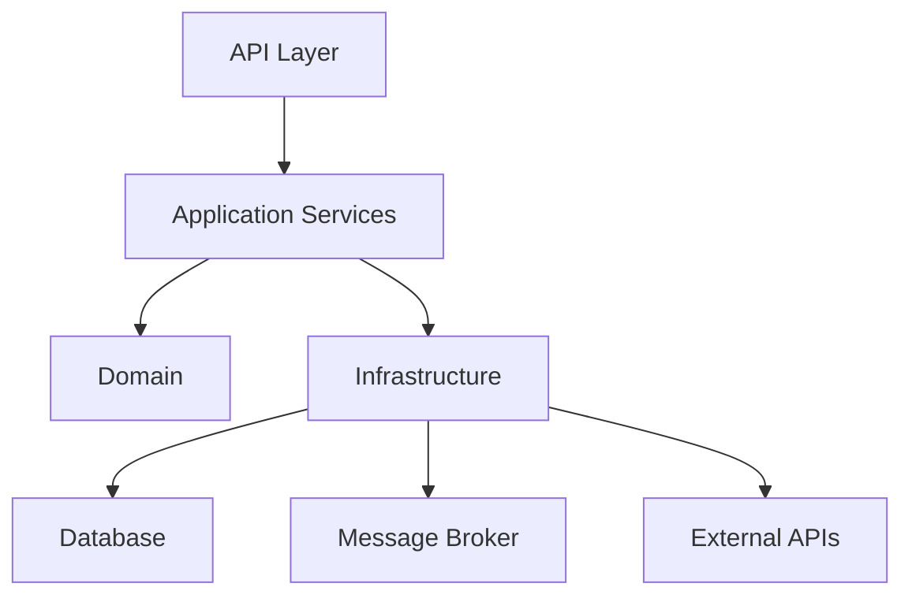

# Architecture

> Copy this template into your project as `docs/ARCHITECTURE.md` and fill it in.
> This gives Claude Code the structural map it needs to constrain impact analysis
> and avoid proposing changes that violate the project's boundaries.

## Architecture style

<!-- e.g. "Modular monolith", "Microservices (event-driven)", "Hexagonal / Ports & Adapters" -->

## Layer diagram

<!-- Replace with an actual diagram (Mermaid, ASCII, or link to image). -->

```
┌─────────────────────────────────────────┐
│              API Gateway                │
├─────────────────────────────────────────┤
│         Controllers / Routes            │
├─────────────────────────────────────────┤
│         Application Services            │
├─────────────────────────────────────────┤
│         Domain / Business Logic         │
├─────────────────────────────────────────┤
│    Infrastructure (DB, Messaging, HTTP)  │
└─────────────────────────────────────────┘
```

## Module / service map

| Module / Service | Layer | Responsibility | Key classes/packages |
|---|---|---|---|
| | | | |

## Dependency flow

<!-- Which module calls which? Arrows indicate direction of dependency. -->



## Sync communication

| Caller | Callee | Protocol | Contract |
|---|---|---|---|
| | | REST / gRPC / Feign | OpenAPI / Proto |

## Async communication

| Producer | Consumer | Broker | Topic / Queue | Delivery semantics |
|---|---|---|---|---|
| | | Kafka / RabbitMQ | | at-least-once / exactly-once |

## Data boundaries

<!-- Which service owns which data? Who reads it, who writes it? -->

| Data | Owner (writes) | Readers | Store |
|---|---|---|---|
| | | | |

## Cross-cutting concerns

| Concern | Implementation | Location |
|---|---|---|
| Authentication | Keycloak / Spring Security | `security/` |
| Authorization | Method-level / endpoint-level | `@PreAuthorize` |
| Logging | SLF4J + structured JSON | `logback-spring.xml` |
| Tracing | Micrometer / Elastic APM | auto-instrumentation |
| Metrics | Prometheus (Micrometer) | `/actuator/prometheus` |
| Config | Spring Cloud Config / k8s ConfigMap | `application-*.yml` |
| Resilience | Resilience4j (circuit breaker, retry) | `@CircuitBreaker` |

## Invariants / rules

<!-- Hard rules that must never be violated. Claude should refuse changes that break these. -->

- [ ] No direct DB access from controllers — always go through services.
- [ ] No business logic in infrastructure layer.
- [ ] No synchronous calls between bounded contexts in production (use events).
- [ ] All public endpoints require authentication.
- [ ]

## Deployment topology

<!-- How is this deployed? Which services run where? -->

| Service | Runtime | Orchestration | Scaling |
|---|---|---|---|
| | Docker container | Kubernetes (Helm + ArgoCD) | HPA |

## Graphify integration (if available)

<!-- If GRAPH_REPORT.md exists, reference it here for the detailed dependency graph. -->
<!-- Claude Code will read GRAPH_REPORT.md for fine-grained impact analysis. -->
<!-- If Graphify is not installed, this section is informational only. -->

- `GRAPH_REPORT.md` location: (project root, or "not available")
- Last generated: (date or "never")
