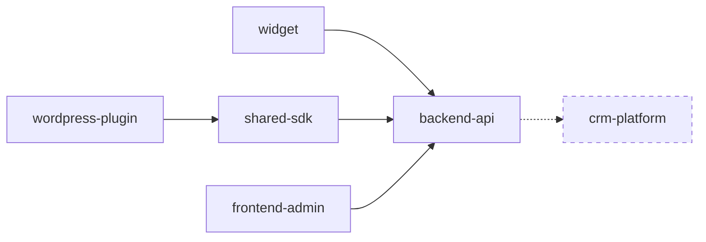

# Dependency Graph

> Template for `.sdd-workspace/DEPENDENCY_GRAPH.md`. **Project-level** edges only — this is not a
> code graph. See [`../WORKSPACE_SDD.md`](../WORKSPACE_SDD.md).

**Last updated:** `YYYY-MM-DD`

> Graphify maps code-level dependencies. Workspace SDD maps project-level dependencies.
> Nothing in this file is derived from `.graphify/graph.json` — cross-project edges come from
> manifests, API descriptors and configuration, each cited below.

## Rules

- **Every relationship carries `Evidence` and `Confidence`.** No edge is written without both.
- **The confidence vocabulary is closed:**
  - `Confirmed` — observed directly in a manifest, descriptor, config or call site. Cite it.
  - `Inferred - requires confirmation` — suggested by a name match, convention or shape, not
    observed. Cite what suggested it.
  - `Unknown - requires confirmation` — believed to exist (someone said so, a gap implies it) but
    with no evidence found.
- **Promoting an edge to `Confirmed` is a deliberate human act.** A later onboarding run never
  upgrades confidence on its own.
- **No invented dependencies.** If nothing was found, record no edge — or an `Unknown` one, with
  the reason.

## Overview

## Relationships

Repeat one block per edge.

---

## Relationship

**From:** `<consumer project>`
**To:** `<provider project>`
**Reason:** `<why the dependency exists, in one line — what the consumer needs from the provider>`
**Contract:** `<the named contract in INTEGRATION_CONTRACTS.md, e.g. REST POST /v1/leads, event lead.created, npm @acme/sdk ^2.4>`
**Evidence:** `<file:line or manifest entry — e.g. widget/src/api.ts:14 calls ${API_BASE}/v1/leads>`
**Confidence:** `Confirmed` | `Inferred - requires confirmation` | `Unknown - requires confirmation`
**Risk:** `<what breaks on the consumer side if the provider changes this, and how it would surface>`

---

## Relationship

**From:** `wordpress-plugin`
**To:** `shared-sdk`
**Reason:** Vendors the SDK to talk to the backend rather than calling the API directly.
**Contract:** npm package `@acme/sdk` `^2.4`
**Evidence:** `wp-plugin/package.json:18` — `"@acme/sdk": "^2.4.0"`
**Confidence:** `Confirmed`
**Risk:** A breaking SDK major ships silently under `^`; the plugin fails at runtime with no
compile-time signal. Pin exactly or add a contract test.

---

## Relationship

**From:** `backend-api`
**To:** `crm-platform`
**Reason:** Believed to forward created leads for sales follow-up.
**Contract:** `Unknown` — no webhook or event definition found in either project.
**Evidence:** `backend-api/.env.example:7` defines `CRM_WEBHOOK_URL`, unused in any source file
found during onboarding.
**Confidence:** `Inferred - requires confirmation`
**Risk:** If real and undocumented, a payload change breaks an integration nobody is watching.
Confirm with the owner before any change to the lead payload.

---

## Ownership collisions

Two projects claiming the same data or surface. Recorded, never silently resolved.

| Claim | Projects | Notes |
|---|---|---|
| `<what is claimed twice>` | `<a>`, `<b>` | `Unknown - requires confirmation` — which is authoritative? |

## Cycles

| Cycle | Confidence | Why it matters |
|---|---|---|
| `<a> → <b> → <a>` | `<Confirmed / Inferred>` | Release order becomes undecidable; note the break point |

## Unknowns

- `Unknown - requires confirmation` — `<edge suspected but unevidenced, and what would confirm it>`
